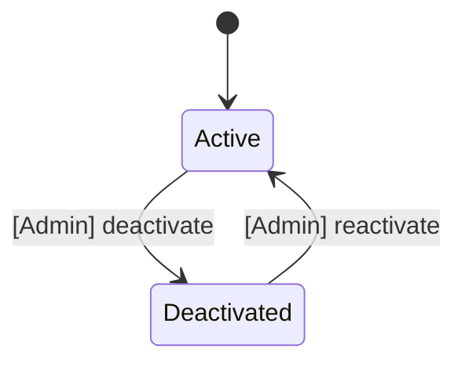
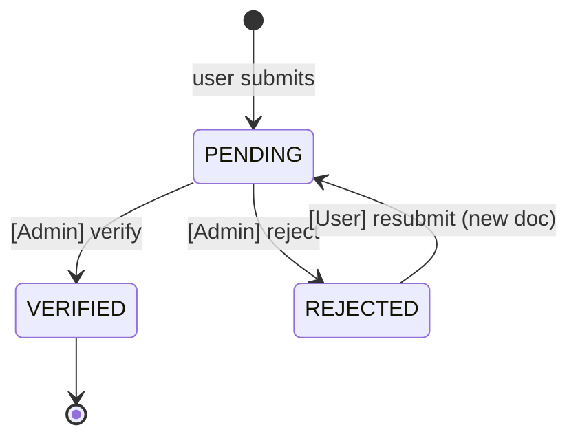
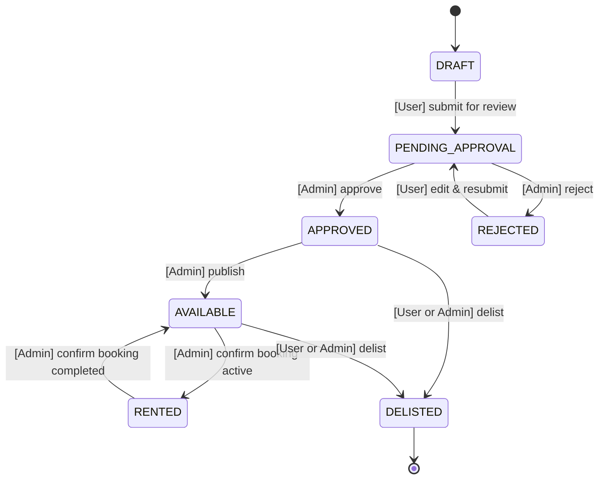
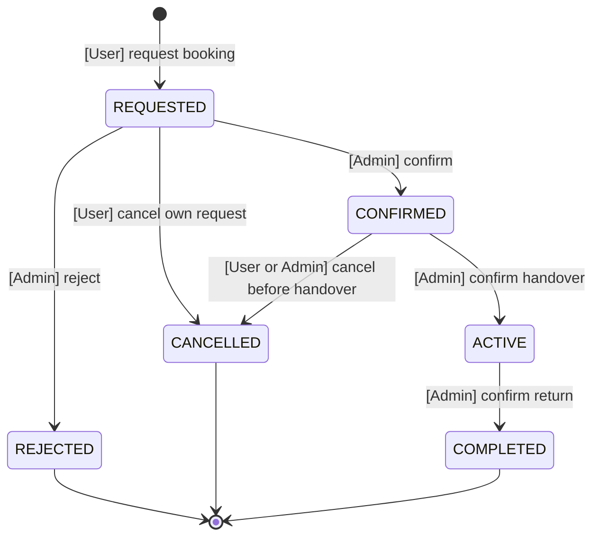
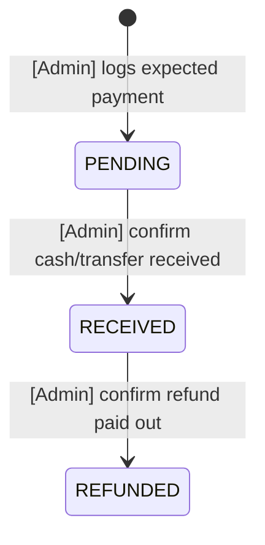
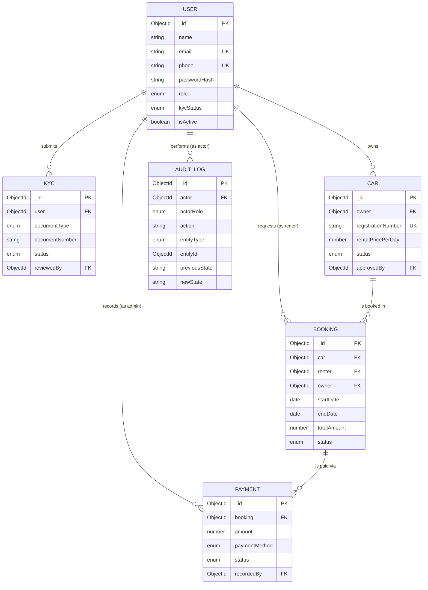

# 01 — Domain Model & State Machines

Status: DRAFT — for review before any implementation.
Scope: WHAT the system is (entities, fields, valid state transitions). No HOW (no routing, no controllers, no UI).

## Hard constraints (from CLAUDE.md, repeated here so this doc is self-contained)

- **No payment gateway.** Every payment is offline / in person. `Payment` records are manual admin entries, never triggered by a webhook or SDK callback.
- **Rental only. The platform never sells a car.** An owner lists a vehicle so other users can rent it. There is no resale, no sale price, no buyer, and no transfer of vehicle ownership anywhere in this system. A car's owner at listing time is its owner for the life of the record.
- **Admin authority is defined by INV-1 and INV-2 below.** Those two invariants replace the earlier absolute phrasing of the admin rule.

### Admin authority: INV-1 and INV-2

An earlier draft of this section stated that admin is the only actor who can move any entity's status forward, and that users never write a status value directly. That absolute form is false against §2 of this same document, which defines ten transitions a non-admin triggers — registering an account, submitting KYC, submitting a listing, requesting a booking, withdrawing that request, and so on. A registration that cannot set `isActive`, or a booking request that cannot reach `REQUESTED`, is not implementable. The absolute rule is therefore withdrawn and replaced.

What the rule was protecting is preserved in two narrower invariants:

> **INV-1 — Visibility.** No status write by a non-admin may make anything visible to a third party. Only an admin can move a `Car` into a publicly listed state, and only after reviewing the content as it stands at that moment.
>
> **INV-2 — Counterparty assets.** No status write by a non-admin may bind, release, or transfer another party's asset or money. Only an admin may confirm a booking, activate a rental, or confirm receipt of payment.

A user may write status freely on their **own intent objects**: a booking request they created, a KYC submission they made, a listing they own that is not yet public. Those are requests, not grants. The moment a status write would be seen by a stranger (INV-1) or would commit another person's car, calendar, or cash (INV-2), an admin must be the actor.

INV-1 restated concretely, replacing the former standalone visibility bullet: nothing is publicly listed until an admin has approved the current content. `DRAFT`, `PENDING_APPROVAL`, and `REJECTED` cars are visible only to their owner and to admins. The complete read-visibility matrix — covering delisted and in-progress-rental cars — is added by amendment 13 (see `docs/design/01-technical-design.md` §14).

### Actor classes

Every transition in §2 is assigned exactly one actor class. The classes are defined here; the `actorClass` column itself is added to the §2 tables by amendment 2.

| Class | Who | Bound by |
|---|---|---|
| `OWNER` | The authenticated user who owns the entity being transitioned — car owner, KYC submitter, the account holder themselves | May act only while the entity is non-public and uncommitted |
| `COUNTERPARTY` | The authenticated user on the other side of a two-party record — the renter on a booking | May create and withdraw their own request; may not bind or release the other party |
| `ADMIN` | Any user with `role: ADMIN` | Unrestricted within the transition tables |

There is no `SYSTEM` actor class. The only cascade this document previously needed one for — auto-cancelling competing purchase offers when a car sold — no longer exists. Every status write in this system has a human actor.

### The non-admin transitions, classified

Each transition in §2 that a non-admin triggers, checked against the invariants:

| # | Transition | Class | Verdict |
|---|---|---|---|
| 1 | `User` registration → `isActive: true` (§2.1) | `OWNER` | Consistent. Creates only the actor's own account. |
| 2 | `KYC` submit → `PENDING` (§2.2) | `OWNER` | Consistent. Grants nothing until an admin verifies. |
| 3 | `KYC` `REJECTED` → new `PENDING` doc (§2.2) | `OWNER` | Consistent. Same as above. |
| 4 | Indirect write to `User.kycStatus` via the mirror rule (§1.1) | `OWNER` | Consistent **after** amendment 9 makes the derivation non-demoting. As written it can silently revoke the actor's own booking ability — a correctness bug, not an invariant breach. |
| 5 | `Car` `DRAFT → PENDING_APPROVAL` (§2.3) | `OWNER` | Consistent. Submission is a request for review; nothing becomes public. |
| 6 | `Car` `REJECTED → PENDING_APPROVAL` (§2.3) | `OWNER` | Consistent. Same as above. |
| 7 | `Car` `APPROVED`/`AVAILABLE` → `DELISTED` (§2.3) | `OWNER` | Consistent. INV-1 governs *becoming* visible, not withdrawing. Requires a guard so an owner cannot delist out from under a live booking. |
| 8 | `Booking` creation → `REQUESTED` (§2.4) | `COUNTERPARTY` | Consistent. A request binds no car and no dates. |
| 9 | `Booking` `REQUESTED → CANCELLED` (§2.4) | `COUNTERPARTY` | Consistent. Withdrawing one's own unconfirmed request. |
| 10 | `Booking` `CONFIRMED → CANCELLED` by the renter (§2.4) | — | **Violates INV-2.** Releases the owner's car and calendar unilaterally. Corrected by amendment 5, which routes it through `CANCELLATION_REQUESTED` for admin resolution. |

Nine of the ten rows above are consistent with INV-1 and INV-2 as the spec currently stands. The one marked violation is left in place deliberately — correcting it means changing §2.4's state machine, which is the scope of amendment 5, not this one. No implementation task may begin until every amendment in `docs/design/01-technical-design.md` §14 has landed.

---

## 1. Entities

Six entities: `User`, `KYC`, `Car`, `Booking`, `Payment`, `AuditLog`.

### 1.1 User

| Field | Type | Required | Notes |
|---|---|---|---|
| `_id` | ObjectId | auto | |
| `name` | string | yes | |
| `email` | string | yes | unique, lowercase, used for login |
| `phone` | string | yes | unique. OPEN QUESTION: is phone verified via OTP, or trusted as-entered? Assumed trusted for v1 since no SMS gateway is in scope. |
| `passwordHash` | string | yes | bcrypt/argon2 hash, never returned by any query (`select: false`) |
| `role` | enum `USER \| ADMIN` | yes | default `USER`. No separate "owner"/"renter" role — any `USER` can list a car and/or rent one. |
| `kycStatus` | enum `NOT_SUBMITTED \| PENDING \| VERIFIED \| REJECTED` | yes | default `NOT_SUBMITTED`. Denormalized copy of the latest `KYC` doc's status, kept in sync by admin action (see §2.2). |
| `isActive` | boolean | yes | default `true`. Admin can deactivate an account (soft-ban) instead of deleting it. |
| `createdAt` / `updatedAt` | Date | auto | |

**OPEN QUESTION:** does a `USER` need `kycStatus = VERIFIED` before they can *list* a car, or only before they can *rent* one? This spec assumes KYC is required to rent (it is the owner's car at risk) but NOT required to list a car (the admin's manual listing approval is the gate for listings instead). Confirm before building the guard conditions in §2.

#### Mongoose schema

```ts
const UserSchema = new Schema({
  name: { type: String, required: true, trim: true },
  email: { type: String, required: true, unique: true, lowercase: true, trim: true },
  phone: { type: String, required: true, unique: true, trim: true },
  passwordHash: { type: String, required: true, select: false },
  role: { type: String, enum: ['USER', 'ADMIN'], default: 'USER', required: true },
  kycStatus: { type: String, enum: ['NOT_SUBMITTED', 'PENDING', 'VERIFIED', 'REJECTED'], default: 'NOT_SUBMITTED', required: true },
  isActive: { type: Boolean, default: true, required: true },
}, { timestamps: true });

UserSchema.index({ email: 1 }, { unique: true });
UserSchema.index({ phone: 1 }, { unique: true });
UserSchema.index({ role: 1 });
```

---

### 1.2 KYC

One document per verification attempt. A user may have multiple `KYC` docs over time (e.g. rejected then resubmitted); `User.kycStatus` always mirrors the newest one.

| Field | Type | Required | Notes |
|---|---|---|---|
| `_id` | ObjectId | auto | |
| `user` | ObjectId ref `User` | yes | |
| `documentType` | enum `AADHAAR \| PAN \| DRIVING_LICENSE \| PASSPORT` | yes | |
| `documentNumber` | string | yes | OPEN QUESTION: encrypt at rest? Recommended, deferred to docs/design (HOW). |
| `documentImageUrl` | string | yes | front image |
| `documentImageBackUrl` | string | no | back image, some ID types don't need one |
| `selfieUrl` | string | no | OPEN QUESTION: is a live selfie/liveness check in scope, or is document-only verification acceptable for v1? Assumed optional/not required. |
| `status` | enum `PENDING \| VERIFIED \| REJECTED` | yes | default `PENDING` |
| `reviewedBy` | ObjectId ref `User` | no | set when admin acts; must be an `ADMIN` |
| `reviewedAt` | Date | no | |
| `rejectionReason` | string | no | required when `status = REJECTED` |
| `createdAt` / `updatedAt` | Date | auto | |

**Note.** A driving licence is the one document type that materially matters for a rental platform — it is what makes a renter legally able to drive. Whether `DRIVING_LICENSE` should be *mandatory* for renters (as opposed to any of the four accepted types) is flagged as an open question in §5.

#### Mongoose schema

```ts
const KycSchema = new Schema({
  user: { type: Schema.Types.ObjectId, ref: 'User', required: true },
  documentType: { type: String, enum: ['AADHAAR', 'PAN', 'DRIVING_LICENSE', 'PASSPORT'], required: true },
  documentNumber: { type: String, required: true },
  documentImageUrl: { type: String, required: true },
  documentImageBackUrl: { type: String },
  selfieUrl: { type: String },
  status: { type: String, enum: ['PENDING', 'VERIFIED', 'REJECTED'], default: 'PENDING', required: true },
  reviewedBy: { type: Schema.Types.ObjectId, ref: 'User' },
  reviewedAt: { type: Date },
  rejectionReason: { type: String },
}, { timestamps: true });

KycSchema.index({ user: 1, createdAt: -1 });
KycSchema.index({ status: 1 });
```

---

### 1.3 Car (rental listing)

Every `Car` is a rental listing. There is no `listingType` and no `salePrice` — a car on this platform is only ever rented out.

| Field | Type | Required | Notes |
|---|---|---|---|
| `_id` | ObjectId | auto | |
| `owner` | ObjectId ref `User` | yes | Never changes. The platform does not transfer vehicle ownership. |
| `make` | string | yes | |
| `model` | string | yes | |
| `year` | number | yes | 4-digit |
| `registrationNumber` | string | yes | unique, uppercase-normalized |
| `color` | string | no | |
| `transmission` | enum `MANUAL \| AUTOMATIC` | yes | |
| `fuelType` | enum `PETROL \| DIESEL \| ELECTRIC \| HYBRID \| CNG` | yes | |
| `seats` | number | yes | |
| `mileageKm` | number | yes | odometer reading at listing time |
| `images` | string[] | yes | at least 1 required (enforced in Zod/validation, not Mongoose-native) |
| `description` | string | no | |
| `location.city` | string | yes | |
| `location.state` | string | yes | |
| `location.geo` | GeoJSON Point | no | OPEN QUESTION: is map/geo search in scope for v1? Field included for future indexing but not required. |
| `rentalPricePerDay` | number | yes | The only price on the entity. |
| `status` | enum (see §2.3) | yes | default `DRAFT` |
| `approvedBy` | ObjectId ref `User` | no | admin who approved |
| `approvedAt` | Date | no | |
| `rejectionReason` | string | no | required when `status = REJECTED` |
| `delistedReason` | string | no | |
| `createdAt` / `updatedAt` | Date | auto | |

**OPEN QUESTION:** currency is assumed to be a single implicit currency (e.g. INR) with no `currency` field. Flag if multi-currency is ever needed.

#### Mongoose schema

```ts
const CarSchema = new Schema({
  owner: { type: Schema.Types.ObjectId, ref: 'User', required: true },
  make: { type: String, required: true, trim: true },
  model: { type: String, required: true, trim: true },
  year: { type: Number, required: true },
  registrationNumber: { type: String, required: true, unique: true, uppercase: true, trim: true },
  color: { type: String },
  transmission: { type: String, enum: ['MANUAL', 'AUTOMATIC'], required: true },
  fuelType: { type: String, enum: ['PETROL', 'DIESEL', 'ELECTRIC', 'HYBRID', 'CNG'], required: true },
  seats: { type: Number, required: true },
  mileageKm: { type: Number, required: true },
  images: { type: [String], required: true },
  description: { type: String },
  location: {
    city: { type: String, required: true },
    state: { type: String, required: true },
    geo: {
      type: { type: String, enum: ['Point'] },
      coordinates: { type: [Number] }, // [lng, lat]
    },
  },
  rentalPricePerDay: { type: Number, required: true },
  status: {
    type: String,
    enum: ['DRAFT', 'PENDING_APPROVAL', 'APPROVED', 'REJECTED', 'AVAILABLE', 'RENTED', 'DELISTED'],
    default: 'DRAFT',
    required: true,
  },
  approvedBy: { type: Schema.Types.ObjectId, ref: 'User' },
  approvedAt: { type: Date },
  rejectionReason: { type: String },
  delistedReason: { type: String },
}, { timestamps: true });

CarSchema.index({ registrationNumber: 1 }, { unique: true });
CarSchema.index({ owner: 1 });
CarSchema.index({ status: 1 });
CarSchema.index({ 'location.city': 1, status: 1 });
CarSchema.index({ 'location.geo': '2dsphere' }, { sparse: true });
```

---

### 1.4 Booking (rental)

| Field | Type | Required | Notes |
|---|---|---|---|
| `_id` | ObjectId | auto | |
| `car` | ObjectId ref `Car` | yes | |
| `renter` | ObjectId ref `User` | yes | |
| `owner` | ObjectId ref `User` | yes | denormalized copy of `Car.owner` at booking time, for query convenience |
| `startDate` | Date | yes | |
| `endDate` | Date | yes | must be after `startDate` |
| `totalAmount` | number | yes | `rentalPricePerDay × days`, computed at request time |
| `status` | enum (see §2.4) | yes | default `REQUESTED` |
| `confirmedBy` | ObjectId ref `User` | no | admin |
| `confirmedAt` | Date | no | |
| `cancelledBy` | ObjectId ref `User` | no | admin OR the renter (self-cancel) |
| `cancellationReason` | string | no | |
| `rejectionReason` | string | no | required when `status = REJECTED` |
| `createdAt` / `updatedAt` | Date | auto | |

**Guard — no overlapping bookings:** before a `Booking` can move `REQUESTED → CONFIRMED`, the system must verify no other `Booking` on the same `car` with status `CONFIRMED` or `ACTIVE` overlaps `[startDate, endDate]`. Multiple `REQUESTED` bookings *may* coexist for overlapping dates (admin picks one to confirm and must reject/cancel the rest) — see OPEN QUESTION below.

**OPEN QUESTION:** should the system block a second `REQUESTED` booking on overlapping dates outright, or allow multiple requests to queue and let admin choose (first-come, negotiation, etc.)? This spec assumes the latter (allow queuing, admin decides) since there's no payment gateway to hold a slot. Confirm.

#### Mongoose schema

```ts
const BookingSchema = new Schema({
  car: { type: Schema.Types.ObjectId, ref: 'Car', required: true },
  renter: { type: Schema.Types.ObjectId, ref: 'User', required: true },
  owner: { type: Schema.Types.ObjectId, ref: 'User', required: true },
  startDate: { type: Date, required: true },
  endDate: { type: Date, required: true },
  totalAmount: { type: Number, required: true },
  status: {
    type: String,
    enum: ['REQUESTED', 'CONFIRMED', 'REJECTED', 'ACTIVE', 'COMPLETED', 'CANCELLED'],
    default: 'REQUESTED',
    required: true,
  },
  confirmedBy: { type: Schema.Types.ObjectId, ref: 'User' },
  confirmedAt: { type: Date },
  cancelledBy: { type: Schema.Types.ObjectId, ref: 'User' },
  cancellationReason: { type: String },
  rejectionReason: { type: String },
}, { timestamps: true });

BookingSchema.index({ car: 1, startDate: 1, endDate: 1 });
BookingSchema.index({ renter: 1, status: 1 });
BookingSchema.index({ owner: 1, status: 1 });
BookingSchema.index({ status: 1 });
```

---

### 1.5 Payment

A manual, admin-entered record of money that changed hands offline. Never created by the system automatically — always the result of an explicit admin action ("mark as received"). Every payment belongs to a `Booking`; there is no other kind of transaction on this platform.

| Field | Type | Required | Notes |
|---|---|---|---|
| `_id` | ObjectId | auto | |
| `booking` | ObjectId ref `Booking` | yes | The only parent a payment can have. |
| `amount` | number | yes | |
| `paymentMethod` | enum `CASH \| BANK_TRANSFER \| UPI \| CHEQUE \| OTHER` | yes | |
| `status` | enum `PENDING \| RECEIVED \| REFUNDED` | yes | default `PENDING` |
| `recordedBy` | ObjectId ref `User` | yes | must be `ADMIN`; the admin who logged this entry |
| `receivedAt` | Date | no | set when `status → RECEIVED` |
| `refundedAt` | Date | no | set when `status → REFUNDED` |
| `referenceNote` | string | no | free text, e.g. UPI transaction id typed in manually |
| `createdAt` / `updatedAt` | Date | auto | |

**OPEN QUESTION:** does a `Booking` need to track partial payments (e.g. deposit now, balance later) as multiple `Payment` docs, or is it always exactly one `Payment` per booking? This spec allows multiple `Payment` docs per booking (sum of `RECEIVED` amounts vs `totalAmount` is a derived check, not a stored field) to support deposits. Confirm if a single-payment model is preferred instead — it would simplify the guard conditions in §2.

**OPEN QUESTION:** is a refundable security deposit, held separately from rental charges, part of the model? Physical-key rental businesses normally take one. Not modelled here — flag if required.

#### Mongoose schema

```ts
const PaymentSchema = new Schema({
  booking: { type: Schema.Types.ObjectId, ref: 'Booking', required: true },
  amount: { type: Number, required: true },
  paymentMethod: { type: String, enum: ['CASH', 'BANK_TRANSFER', 'UPI', 'CHEQUE', 'OTHER'], required: true },
  status: { type: String, enum: ['PENDING', 'RECEIVED', 'REFUNDED'], default: 'PENDING', required: true },
  recordedBy: { type: Schema.Types.ObjectId, ref: 'User', required: true },
  receivedAt: { type: Date },
  refundedAt: { type: Date },
  referenceNote: { type: String },
}, { timestamps: true });

PaymentSchema.index({ booking: 1 });
PaymentSchema.index({ status: 1 });
```

---

### 1.6 AuditLog

Immutable append-only record of every admin-triggered (and self-service, e.g. cancellation) state transition in the system. Never updated or deleted.

| Field | Type | Required | Notes |
|---|---|---|---|
| `_id` | ObjectId | auto | |
| `actor` | ObjectId ref `User` | yes | who performed the action (admin in nearly all cases; a `USER` for self-cancel actions) |
| `actorRole` | enum `USER \| ADMIN` | yes | denormalized snapshot of `actor.role` at the time, so history reads correctly even if role changes later |
| `action` | string (enum, see below) | yes | |
| `entityType` | enum `USER \| KYC \| CAR \| BOOKING \| PAYMENT` | yes | |
| `entityId` | ObjectId | yes | not a strict `ref` (polymorphic across the enum above) |
| `previousState` | string | no | previous `status` value, when the action is a state transition |
| `newState` | string | no | new `status` value |
| `reason` | string | no | free text — rejection reason, cancellation reason, admin note |
| `metadata` | Mixed | no | arbitrary extra context (e.g. amount for a payment log) |
| `ipAddress` | string | no | |
| `createdAt` | Date | auto | no `updatedAt` — this collection is insert-only |

`action` enum (extend as needed, one entry per possible transition across all entities):
`USER_DEACTIVATED`, `USER_REACTIVATED`,
`KYC_SUBMITTED`, `KYC_VERIFIED`, `KYC_REJECTED`,
`CAR_SUBMITTED`, `CAR_APPROVED`, `CAR_REJECTED`, `CAR_PUBLISHED`, `CAR_DELISTED`, `CAR_MARKED_RENTED`, `CAR_MARKED_AVAILABLE`,
`BOOKING_REQUESTED`, `BOOKING_CONFIRMED`, `BOOKING_REJECTED`, `BOOKING_STARTED`, `BOOKING_COMPLETED`, `BOOKING_CANCELLED`,
`PAYMENT_RECORDED`, `PAYMENT_RECEIVED_CONFIRMED`, `PAYMENT_REFUNDED`

#### Mongoose schema

```ts
const AuditLogSchema = new Schema({
  actor: { type: Schema.Types.ObjectId, ref: 'User', required: true },
  actorRole: { type: String, enum: ['USER', 'ADMIN'], required: true },
  action: { type: String, required: true },
  entityType: { type: String, enum: ['USER', 'KYC', 'CAR', 'BOOKING', 'PAYMENT'], required: true },
  entityId: { type: Schema.Types.ObjectId, required: true },
  previousState: { type: String },
  newState: { type: String },
  reason: { type: String },
  metadata: { type: Schema.Types.Mixed },
  ipAddress: { type: String },
}, { timestamps: { createdAt: true, updatedAt: false } });

AuditLogSchema.index({ entityType: 1, entityId: 1, createdAt: -1 });
AuditLogSchema.index({ actor: 1, createdAt: -1 });
AuditLogSchema.index({ action: 1 });
```

**Rule:** every service-layer function that changes a `status` field MUST write exactly one `AuditLog` document in the same transaction/session as the state change. This is not optional and should be enforced structurally in docs/design (e.g. a single `transition()` helper that both writes and logs), not left to each call site to remember.

---

## 2. State machines

Convention: **[Admin]** = only an admin can trigger this transition. **[User]** = the acting user (owner or renter) can trigger it.

**OPEN QUESTION (cross-cutting):** should date-driven transitions — `CONFIRMED → ACTIVE` on `startDate` and `ACTIVE → COMPLETED` on `endDate` — require an explicit admin click, or may they be automated? This spec models them as manual, because handover and return are physical events an admin witnesses, not calendar facts. Confirm.

### 2.1 User (role/activity, not KYC)



| From | To | Trigger | Guard |
|---|---|---|---|
| — | `isActive=true` | [User] registers | email+phone unique |
| `isActive=true` | `isActive=false` | [Admin] deactivate | none |
| `isActive=false` | `isActive=true` | [Admin] reactivate | none |

### 2.2 KYC



| From | To | Trigger | Guard |
|---|---|---|---|
| — | `PENDING` | [User] submits KYC doc | user has no other `PENDING` KYC doc open |
| `PENDING` | `VERIFIED` | [Admin] approve | acting user is `ADMIN`; on success, `User.kycStatus` set to `VERIFIED` |
| `PENDING` | `REJECTED` | [Admin] reject | `rejectionReason` required; `User.kycStatus` set to `REJECTED` |
| `REJECTED` | (new `PENDING` doc) | [User] resubmit | creates a new `KYC` document rather than mutating the rejected one (keeps history) |

### 2.3 Car



| From | To | Trigger | Guard |
|---|---|---|---|
| — | `DRAFT` | [User] creates listing | owner's `kycStatus` not required (see OPEN QUESTION §1.1) |
| `DRAFT` | `PENDING_APPROVAL` | [User] submits | all required fields present, including `rentalPricePerDay` |
| `PENDING_APPROVAL` | `APPROVED` | [Admin] approve | none beyond field completeness already checked |
| `PENDING_APPROVAL` | `REJECTED` | [Admin] reject | `rejectionReason` required |
| `REJECTED` | `PENDING_APPROVAL` | [User] edits and resubmits | owner matches `Car.owner` |
| `APPROVED` | `AVAILABLE` | [Admin] publish live | OPEN QUESTION: is `APPROVED` a distinct step from `AVAILABLE`, or does approval immediately make it available/public? This spec keeps them separate in case admin wants to approve content but schedule the public listing later; may be unnecessary — confirm and collapse into one transition if so. |
| `AVAILABLE` | `RENTED` | [Admin] confirms a `Booking` reached `ACTIVE` | corresponding `Booking.status = ACTIVE` |
| `RENTED` | `AVAILABLE` | [Admin] confirms the `Booking` reached `COMPLETED` | corresponding `Booking.status = COMPLETED` |
| `APPROVED`/`AVAILABLE` | `DELISTED` | [User] or [Admin] delist | not currently `RENTED` (must wait for active rental to finish or be cancelled first) |
| `DELISTED` | — | terminal as written | no relisting path. Flagged as a defect; corrected by amendment 3. |

### 2.4 Booking



| From | To | Trigger | Guard |
|---|---|---|---|
| — | `REQUESTED` | [User] (renter) requests | `car.status = AVAILABLE`; renter's `User.kycStatus = VERIFIED`; `startDate < endDate`, `startDate ≥ today` |
| `REQUESTED` | `CONFIRMED` | [Admin] confirms | no other `Booking` on same `car` is `CONFIRMED`/`ACTIVE` with overlapping dates; `Car.status` unaffected yet (stays `AVAILABLE` until handover) |
| `REQUESTED` | `REJECTED` | [Admin] rejects | `rejectionReason` required |
| `REQUESTED` | `CANCELLED` | [User] (renter) cancels own request | acting user is the `renter` |
| `CONFIRMED` | `ACTIVE` | [Admin] confirms car handed over | `startDate` reached; on success, `Car.status → RENTED`. No payment guard as written — flagged as a defect; corrected by amendment 7. |
| `CONFIRMED` | `CANCELLED` | [User or Admin] cancels before handover | `cancellationReason` required; if a `Payment` was already `RECEIVED`, a refund `Payment` should be recorded (manual, offline) |
| `ACTIVE` | `COMPLETED` | [Admin] confirms car returned | on success, `Car.status → AVAILABLE` |
| `ACTIVE` | — | no cancellation path once active | Flagged as a defect (strands write-offs and disputes); corrected by amendment 5. |

### 2.5 Payment



| From | To | Trigger | Guard |
|---|---|---|---|
| — | `PENDING` | [Admin] records that a payment is expected (e.g. when `Booking → CONFIRMED`) | parent `booking` exists and is in a state that expects payment |
| `PENDING` | `RECEIVED` | [Admin] confirms money actually received offline | `receivedAt` set |
| `RECEIVED` | `REFUNDED` | [Admin] confirms refund handed back | only reachable if the parent `Booking` was cancelled after payment |

---

## 3. Zod schemas

Mirrors §1 exactly; lives in `/shared` so both `/client` and `/server` import the same source of truth.

> **Known defect, corrected by amendment 10:** the block below cannot compile under any single Zod major — `.omit()` after `.refine()` requires v4, while `z.record(z.unknown())` requires v3 — and it imports `mongoose` into `/shared`, which would pull the ODM into the browser bundle.

```ts
import { z } from 'zod';
import { Types } from 'mongoose';

const objectId = z.string().refine((v) => Types.ObjectId.isValid(v), 'Invalid ObjectId');

// ---- User ----
export const userRoleSchema = z.enum(['USER', 'ADMIN']);
export const kycStatusSchema = z.enum(['NOT_SUBMITTED', 'PENDING', 'VERIFIED', 'REJECTED']);

export const userSchema = z.object({
  _id: objectId,
  name: z.string().min(1).max(120),
  email: z.string().email(),
  phone: z.string().min(7).max(15),
  role: userRoleSchema.default('USER'),
  kycStatus: kycStatusSchema.default('NOT_SUBMITTED'),
  isActive: z.boolean().default(true),
  createdAt: z.date(),
  updatedAt: z.date(),
});
export const createUserSchema = userSchema
  .pick({ name: true, email: true, phone: true })
  .extend({ password: z.string().min(8) });

// ---- KYC ----
export const kycDocTypeSchema = z.enum(['AADHAAR', 'PAN', 'DRIVING_LICENSE', 'PASSPORT']);
export const kycStatusValueSchema = z.enum(['PENDING', 'VERIFIED', 'REJECTED']);

export const kycSchema = z.object({
  _id: objectId,
  user: objectId,
  documentType: kycDocTypeSchema,
  documentNumber: z.string().min(1),
  documentImageUrl: z.string().url(),
  documentImageBackUrl: z.string().url().optional(),
  selfieUrl: z.string().url().optional(),
  status: kycStatusValueSchema.default('PENDING'),
  reviewedBy: objectId.optional(),
  reviewedAt: z.date().optional(),
  rejectionReason: z.string().optional(),
  createdAt: z.date(),
  updatedAt: z.date(),
});
export const submitKycSchema = kycSchema.pick({
  documentType: true,
  documentNumber: true,
  documentImageUrl: true,
  documentImageBackUrl: true,
  selfieUrl: true,
});
export const reviewKycSchema = z.discriminatedUnion('status', [
  z.object({ status: z.literal('VERIFIED') }),
  z.object({ status: z.literal('REJECTED'), rejectionReason: z.string().min(1) }),
]);

// ---- Car ----
export const transmissionSchema = z.enum(['MANUAL', 'AUTOMATIC']);
export const fuelTypeSchema = z.enum(['PETROL', 'DIESEL', 'ELECTRIC', 'HYBRID', 'CNG']);
export const carStatusSchema = z.enum([
  'DRAFT', 'PENDING_APPROVAL', 'APPROVED', 'REJECTED', 'AVAILABLE', 'RENTED', 'DELISTED',
]);

export const carSchema = z.object({
  _id: objectId,
  owner: objectId,
  make: z.string().min(1),
  model: z.string().min(1),
  year: z.number().int().min(1980).max(new Date().getFullYear() + 1),
  registrationNumber: z.string().min(1),
  color: z.string().optional(),
  transmission: transmissionSchema,
  fuelType: fuelTypeSchema,
  seats: z.number().int().min(1).max(20),
  mileageKm: z.number().min(0),
  images: z.array(z.string().url()).min(1),
  description: z.string().optional(),
  location: z.object({
    city: z.string().min(1),
    state: z.string().min(1),
    geo: z.object({
      type: z.literal('Point'),
      coordinates: z.tuple([z.number(), z.number()]),
    }).optional(),
  }),
  rentalPricePerDay: z.number().positive(),
  status: carStatusSchema.default('DRAFT'),
  approvedBy: objectId.optional(),
  approvedAt: z.date().optional(),
  rejectionReason: z.string().optional(),
  delistedReason: z.string().optional(),
  createdAt: z.date(),
  updatedAt: z.date(),
});

export const createCarSchema = carSchema.omit({
  _id: true, status: true, approvedBy: true, approvedAt: true,
  rejectionReason: true, delistedReason: true, createdAt: true, updatedAt: true,
});

// ---- Booking ----
export const bookingStatusSchema = z.enum([
  'REQUESTED', 'CONFIRMED', 'REJECTED', 'ACTIVE', 'COMPLETED', 'CANCELLED',
]);

export const bookingSchema = z.object({
  _id: objectId,
  car: objectId,
  renter: objectId,
  owner: objectId,
  startDate: z.date(),
  endDate: z.date(),
  totalAmount: z.number().positive(),
  status: bookingStatusSchema.default('REQUESTED'),
  confirmedBy: objectId.optional(),
  confirmedAt: z.date().optional(),
  cancelledBy: objectId.optional(),
  cancellationReason: z.string().optional(),
  rejectionReason: z.string().optional(),
  createdAt: z.date(),
  updatedAt: z.date(),
}).refine((b) => b.endDate > b.startDate, { message: 'endDate must be after startDate', path: ['endDate'] });

export const requestBookingSchema = z.object({
  car: objectId,
  startDate: z.coerce.date(),
  endDate: z.coerce.date(),
}).refine((b) => b.endDate > b.startDate, { message: 'endDate must be after startDate', path: ['endDate'] });

// ---- Payment ----
export const paymentMethodSchema = z.enum(['CASH', 'BANK_TRANSFER', 'UPI', 'CHEQUE', 'OTHER']);
export const paymentStatusSchema = z.enum(['PENDING', 'RECEIVED', 'REFUNDED']);

export const paymentSchema = z.object({
  _id: objectId,
  booking: objectId,
  amount: z.number().positive(),
  paymentMethod: paymentMethodSchema,
  status: paymentStatusSchema.default('PENDING'),
  recordedBy: objectId,
  receivedAt: z.date().optional(),
  refundedAt: z.date().optional(),
  referenceNote: z.string().optional(),
  createdAt: z.date(),
  updatedAt: z.date(),
});

export const recordPaymentSchema = z.object({
  booking: objectId,
  amount: z.number().positive(),
  paymentMethod: paymentMethodSchema,
  referenceNote: z.string().optional(),
});

// ---- AuditLog ----
export const auditEntityTypeSchema = z.enum(['USER', 'KYC', 'CAR', 'BOOKING', 'PAYMENT']);

export const auditLogSchema = z.object({
  _id: objectId,
  actor: objectId,
  actorRole: userRoleSchema,
  action: z.string().min(1),
  entityType: auditEntityTypeSchema,
  entityId: objectId,
  previousState: z.string().optional(),
  newState: z.string().optional(),
  reason: z.string().optional(),
  metadata: z.record(z.unknown()).optional(),
  ipAddress: z.string().optional(),
  createdAt: z.date(),
});
```

---

## 4. Entity-relationship diagram



---

## 5. Consolidated list of open questions

1. §1.1 — Is KYC required to *list* a car, or only to *rent* one? (assumed: only to rent)
2. §1.2 — Must a renter specifically hold a verified `DRIVING_LICENSE`, or does any accepted document type satisfy the rental guard? (not decided; materially affects who may book)
3. §1.3 — Single currency assumed (no `currency` field) — confirm.
4. §1.3 — Is `APPROVED` a meaningfully distinct state from `AVAILABLE`, or should admin approval immediately publish the listing? (assumed: distinct, admin-controlled publish step)
5. §1.4 — Should overlapping `REQUESTED` bookings on the same car be blocked outright, or allowed to queue for admin to choose? (assumed: allowed to queue)
6. §1.4 / §2.4 — Is a mid-rental cancellation (`ACTIVE → CANCELLED`, e.g. accident/dispute) needed? (not modelled; corrected by amendment 5)
7. §1.5 — Are partial/multiple payments per booking needed (deposit + balance), or always exactly one `Payment` record? (assumed: multiple allowed)
8. §1.5 — Is a refundable security deposit, tracked separately from rental charges, in scope? (not modelled)
9. §1.5 — Is refund tracking mandatory (a `REFUNDED` `Payment` doc required) whenever a paid booking is cancelled, or just a manual note? (assumed: mandatory doc, but not enforced with a hard guard)
10. §2 (cross-cutting) — Must `CONFIRMED → ACTIVE` and `ACTIVE → COMPLETED` go through an explicit admin click, or may they be automated? (assumed: manual — they are physical handover events)
11. §1.2 — Is a liveness-check selfie in scope for KYC, or document-only verification? (assumed: document-only, selfie optional)
12. §1.3 — Is geo/map search in scope for v1? (`location.geo` field included but optional/unused if not)
13. §1.1 — Is phone verified via OTP or trusted as entered? (assumed trusted; no SMS gateway in scope)
14. Soft-delete vs. hard-delete policy for `User`/`Car` — not addressed; this spec assumes nothing is ever hard-deleted (only deactivated/delisted), consistent with the audit trail requirement.

---

## 6. Explicitly out of scope

- **Selling or reselling vehicles.** No sale price, no buyer, no offer or negotiation flow, no ownership transfer, no `SaleTransaction` entity. A previous draft of this spec modelled a full resale flow; it has been removed in its entirety. If resale is ever reintroduced it is a new spec, not an amendment to this one.
- **Peer-to-peer payment between renter and owner.** All money is handled offline and recorded by an admin.
