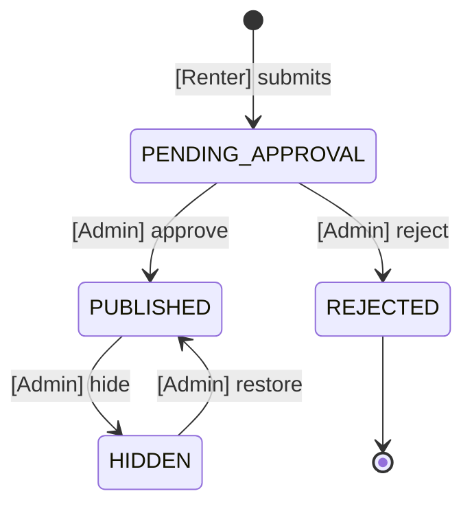

# 04 — Business Logic

Status: DRAFT — for review before any code.
Reads: `specs/01-domain-and-state-machines.md` (entities, state machines), `specs/02-api-contract.md` (endpoints, guards, error contract), `specs/03-auth-and-roles.md` (roles, authorization, licence capture), `docs/design/01-technical-design.md` (D1–D10).
Feeds: `tasks/01-implementation-plan.md` — blocks `CAR`, `BOOK`, `PAY`, `ADM`, and a new `REV` (reviews) block this document requires.

**Scope.** Car **rental only**. There is no sale, no resale, no buyer, no sale price, no offer, no negotiation, no ownership transfer. Nothing in this document may be extended toward one.

## Authority

This document is written against the **post-amendment** domain model — that is, `specs/01-domain-and-state-machines.md` as it will read once the `S`-block of `tasks/01-implementation-plan.md` has landed (amendments 1–13 in `docs/design/01-technical-design.md` §14), **plus** the amendments spec 03 §13 and §11 of this document require. It adopts spec 02's authority declaration verbatim and extends it.

Concretely, every rule below assumes:

| Assumption | Source | Status in spec 01 as merged |
|---|---|---|
| `Car.status` is split into `moderationStatus` + `listingState`; availability is **derived, never stored** | D2 | **Not applied.** Spec 01 §1.3 still has one `status` enum containing `AVAILABLE` and `RENTED`. |
| `Booking.status` includes `CANCELLATION_REQUESTED` and `TERMINATED` | D4 | **Not applied.** Spec 01 §2.4 has neither, and models renter self-cancel from `CONFIRMED` (which it flags as an INV-2 violation in its own row 10). |
| `Booking.status` includes `NO_SHOW` | spec 02 OQ-45 option (a) | **Not applied.** `Δ-B8`. |
| `BookingDayLock` exists and is the sole arbiter of double-booking | D5 | **Not applied.** The entity is absent from spec 01 entirely. |
| `Booking.amountReceived` and `ratePerDaySnapshot` exist | D6 | **Not applied.** |
| `Payment` has `direction: IN \| OUT`, `refundOf`, and status `PENDING \| SETTLED \| VOID`; `REFUNDED` does not exist | D7 | **Not applied.** Spec 01 §2.5 is `PENDING → RECEIVED → REFUNDED` with no `direction`. |
| `User.role` includes `SUPER_ADMIN`; `Session` and `PasswordReset` exist | spec 03 `Δ-4`, `Δ-9` | **Not applied.** |
| **D8 is void in full** — there is no `KYC` entity and no `User.kycStatus` to derive | this document, X-B21 | n/a — D8 must be withdrawn, not applied. |

> **Two spec 01 §2.3 rows are negated by D2 and this document does not reinstate them.** `AVAILABLE → RENTED` (*"[Admin] confirms a Booking reached ACTIVE"*) and `RENTED → AVAILABLE` (*"[Admin] confirms the Booking reached COMPLETED"*) describe a field D2 deletes. §3.3's booking table therefore shows `Car` as **untouched** on both activate and complete, and that is correct **only** under D2. See X-A13.
>
> **IF** the D2 amendment does not land before implementation **THEN** a car reaches `RENTED` through spec 01 §2.3 and **no rule in this document ever clears it** — the car is stranded in a state with no outgoing edge, failing design §11's `INV-4`. This is not a defect in §3.3; it is the consequence of implementing against an un-amended spec 01.

**No implementation task in the `CAR`, `BOOK`, `PAY`, `ADM`, or `REV` blocks may begin until every amendment above has landed and every `BLOCKING` question in §10 is answered.**

**Three constraints govern every rule below.** They are not defaults; they are the shape of the product.

1. **No payment gateway.** Every rupee moves offline, in person, hand to hand. Every amount this system displays is a *quote*, and every amount it stores as received is an *admin's assertion that cash arrived*.
2. **Every state transition is admin-triggered**, in the narrowed form specs 01/02/03 already agreed (INV-1/INV-2, AUTHZ-1…AUTHZ-4): a non-admin may create and withdraw their own requests; only an admin may bind, release, publish, or settle. The eight closed exceptions of spec 03 §2.4 are the complete list and this document adds none.
3. **No online identity or document verification of any kind.** See the conflicts section immediately below — this constraint contradicts large parts of specs 01 and 02 and part of spec 03, and every contradiction is listed rather than quietly dropped.

---

## CONFLICTS WITH EARLIER SPECS

The constraint given to this document is:

> **There is NO online KYC and NO document verification. No document upload, no document review queue, no verification status, and no verification-based gating anywhere. Identity and licence checks happen entirely offline, in person, at handover.**

Specs 01, 02, and 03 contain material that contradicts this. **Every conflict is enumerated here. None of it is silently ignored, and none of it may be resolved by an implementation task** — each needs a spec amendment first (`CLAUDE.md`: *"Never modify specs while implementing"*).

Conflicts are numbered `X-n`. The **Resolution** column states what this document assumes; where the resolution is not obvious it is also raised as an OPEN QUESTION in §10.

### X-A — Conflicts with `specs/01-domain-and-state-machines.md`

| # | Location | What it says | Why it conflicts | Resolution assumed here |
|---|---|---|---|---|
| **X-A1** | §1 *("Six entities")*, §1.2 | Defines a `KYC` entity: one document per verification attempt, with `documentType`, `documentNumber`, `documentImageUrl`, `documentImageBackUrl`, `selfieUrl`, `status`, `reviewedBy`, `reviewedAt`, `rejectionReason`, plus two indexes and a Mongoose schema. | This is *the* document-upload-and-review entity. Its existence is the online verification system. | **Delete the entity in full.** Entity count drops from six to five: `User`, `Car`, `Booking`, `Payment`, `AuditLog` (plus the entities spec 03 and this document add — §11). Matches spec 03 `Δ-1`, which already ordered this deletion; specs 01/02 have not yet been amended to reflect it. |
| **X-A2** | §1.1 | `User.kycStatus: NOT_SUBMITTED \| PENDING \| VERIFIED \| REJECTED`, required, default `NOT_SUBMITTED`, *"denormalized copy of the latest KYC doc's status"*. | A verification status field on the user. | **Delete the field and its enum.** Matches spec 03 `Δ-2`. |
| **X-A3** | §2.2 | The entire KYC state machine: `— → PENDING → VERIFIED / REJECTED`, `REJECTED → new PENDING`, with `[Admin] approve` / `[Admin] reject` rows. | This is the document review queue. | **Delete §2.2 entirely.** The `User` state machine (§2.1) and spec 03 §11's role transitions remain. |
| **X-A4** | §2.4, row 1 | Booking `— → REQUESTED` guard: *"renter's `User.kycStatus = VERIFIED`"*. | Verification-status gating on the single most important user action in the platform. | **Delete the clause.** Replaced by §3.1 of this document, which defines non-verification preconditions. |
| **X-A5** | §2.3, row 1 | Car `— → DRAFT` guard: *"owner's `kycStatus` not required (see OPEN QUESTION §1.1)"*. | The open question it points at is *"is KYC required to list?"* — a verification gate either way. | **Delete the clause and the open question.** Listing requires no verification, because no verification exists. |
| **X-A6** | §1.1, OPEN QUESTION under the table | *"does a `USER` need `kycStatus = VERIFIED` before they can list a car, or only before they can rent one?"* | Presupposes verification. | **Question is void.** Not answered — removed, because it has no remaining content. |
| **X-A7** | §1.2, Note | *"Whether `DRIVING_LICENSE` should be mandatory for renters … is flagged as an open question in §5."* | Presupposes a document-type discriminator and a verification decision. | **Void.** There is one licence field (§X-C1) and it is captured for every user; there is nothing to make conditional. |
| **X-A8** | §1.6 | `AuditLog.entityType` enum includes `KYC`; the `action` enum includes `KYC_SUBMITTED`, `KYC_VERIFIED`, `KYC_REJECTED`. | Audit surface for a review queue that must not exist. | **Remove `KYC` from `entityType`; remove the three actions.** Matches spec 03 `Δ-3`. |
| **X-A9** | §3 (Zod) | `kycStatusSchema`, `kycDocTypeSchema`, `kycStatusValueSchema`, `kycSchema`, `submitKycSchema`, `reviewKycSchema`; `userSchema.kycStatus`. | Shared-type surface for the same. | **Delete all six; remove `kycStatus` from `userSchema`.** |
| **X-A10** | §4 (ERD) | `USER \|\|--o{ KYC : submits` and the `KYC` node. | — | **Delete the node and the relationship.** |
| **X-A11** | §5, OQ#1, OQ#2, OQ#11 | *"Is KYC required to list, or only to rent?"*; *"Must a renter hold a verified `DRIVING_LICENSE`?"*; *"Is a liveness-check selfie in scope?"* | All three presuppose verification. | **All three void, closed by deletion rather than by decision.** Spec 03 §14 already recorded them as closed; specs 01/02 still carry them. |
| **X-A12** | §1.5, OPEN QUESTION | *"is a refundable security deposit … part of the model? Not modelled here — flag if required."* | Not a KYC conflict, but a gap this document must close, because a cash rental business takes a deposit and §6 specifies one. | **Answered here: yes.** §2.4 and §6 define it. Requires spec 01 `Payment` to gain a `purpose` discriminator — §11 `Δ-B3`. |
| **X-A13** | §2.3, rows 7–8 | `AVAILABLE → RENTED` — *"[Admin] confirms a Booking reached ACTIVE"*; `RENTED → AVAILABLE` — *"[Admin] confirms the Booking reached COMPLETED"*. | **Not a KYC conflict.** These two rows write a `Car` field that D2 deletes. §3.3 of this document shows `Car` as **untouched** on activate and complete, which negates both rows. Spec 02 E-39 already noted the first (*"spec §2.3's `AVAILABLE → RENTED` row disappears with the amendment"*); the second was never stated anywhere. | **Delete both rows** with the D2 amendment. Availability is derived from `BookingDayLock` (§1.2); `Car` carries no booking-derived state at all. **IF** D2 is not applied first **THEN** `RENTED` becomes a stuck state — see the Authority section. `Δ-B10a`. |
| **X-A14** | §2.4 | The `Booking` state machine has no `CANCELLATION_REQUESTED`, no `TERMINATED`, and no `NO_SHOW`; row 10 models a renter cancelling a `CONFIRMED` booking directly, which spec 01 itself marks as *"**Violates INV-2**"*. | §3 and §5 of this document use all three states throughout, and §5.1 routes `CONFIRMED` cancellation through `CANCELLATION_REQUESTED` for admin resolution. | **Apply D4** (adds `CANCELLATION_REQUESTED`, `TERMINATED`, removes the INV-2-violating edge) **and `Δ-B8`** (adds `NO_SHOW`). All three states and their edges are listed in `Δ-B8`. |
| **X-A15** | §1.5, §2.5 | `Payment` has no `direction` field; its states are `PENDING \| RECEIVED \| REFUNDED`; §2.5's machine is `— → PENDING → RECEIVED → REFUNDED`. | §3.3 and §6.1 depend on `direction: IN \| OUT`, `status: PENDING \| SETTLED \| VOID`, and `refundOf`. §6.1's four-way `purpose × direction` matrix is unrepresentable without `direction`. | **Apply D7** in full — `RECEIVED` renamed `SETTLED`, `REFUNDED` deleted (a refund is a new `OUT` payment, never a mutation), `VOID` added, `direction` and `refundOf` added. Then `Δ-B3` adds `purpose` on top. **Spec 02 OQ-55 also applies** — see §10. |

### X-B — Conflicts with `specs/02-api-contract.md`

| # | Location | What it says | Why it conflicts | Resolution assumed here |
|---|---|---|---|---|
| **X-B1** | §10.3, E-22 | `POST /api/user/kyc` — *"submit KYC document URLs"*, creating a `KYC` in `PENDING`. | A document upload endpoint. | **Delete the endpoint and `submitKycDto`.** |
| **X-B2** | §10.3, E-23, E-24 | `GET /api/user/kyc`, `GET /api/user/kyc/:kycId` — the submitter's document history. | Reads of the review queue. | **Delete both.** |
| **X-B3** | §11.5, E-52, E-53 | `GET /api/admin/kyc` (*"Queue default: `?status=PENDING&sort=createdAt:asc`"*), `GET /api/admin/kyc/:kycId`. | **This is literally the document review queue.** | **Delete both, plus `adminKycQueryDto`, `KycRecord`, `AdminKycRecord`.** |
| **X-B4** | §11.5, E-54, E-55, E-56 | `POST .../verify`, `.../reject`, `.../revoke`. | The review actions themselves. | **Delete all three and their DTOs (`verifyKycDto`, `rejectKycDto`, `revokeKycDto`).** |
| **X-B5** | §12 (guard index) | `guardOwnerKycIfRequired`, `guardRenterKycVerified`, `guardDrivingLicenceIfRequired`, `guardNoOpenKycSubmission`, `guardStatusIsVerified`. | Verification gates on E-09, E-17, E-39, E-41, E-54. | **Delete all five.** Spec 03 `TR-22` fails the build if a guard matching `/kyc\|verif/i` is ever registered; this document keeps that test. |
| **X-B6** | §12, `guardDocumentUrlsAllowed` (E-22) | Validates that every submitted URL is `https` and on the configured storage host. | Its *KYC* use disappears with E-22. | **RETAIN and repoint at `Car.images`** — do **not** delete. Spec 03 `Δ-3` repointed it at `drivingLicence.imageUrl`, which X-C1 removes; but `createCarDto` still requires `images[≥1]` and spec 01 §1.3 declares `images: { type: [String], required: true }` **with no URL, scheme, or host validation at any layer**. This guard is the only such check in the platform. Deleting it would leave owner-supplied image URLs entirely unvalidated — an arbitrary-origin injection surface that X-C6's CSP `img-src` narrows but does not close, since a same-host attacker-controlled path still passes CSP. **Renamed `guardImageUrlsAllowed`** and applied to **E-09** and **E-10** (any write touching `images`). `Δ-B19`. |
| **X-B7** | §6.1, §7.2 | Access token `rgo_at` carries a `kycStatus` claim; `UserSummary` = `id, name, email, phone, role, kycStatus, isActive`. | A verification status on the wire and in the session. | **Remove `kycStatus` from the claim set and from `UserSummary`.** Spec 03 §4.4 already removed the claim; §7.2's `UserSummary` has not been amended. |
| **X-B8** | §8, E-05 | `GET /api/auth/me` returns `permissions: { canRequestBooking, canCreateListing }` *"derived from the database `kycStatus`"*, and `counts.pendingKyc`. | Client-side rendering of a verification gate. | **Remove `permissions` and `counts.pendingKyc`.** Replaced by `flags` — §3.1 defines `canRequestBooking` on non-verification grounds, so the key survives with a different derivation. See OQ-B3. |
| **X-B9** | §11.6, E-57 | `adminUsersQueryDto` has a `kycStatus` filter (repeatable). | Filtering a user list by verification state. | **Remove the parameter.** An unknown query key is `400` (§4.3), so removal is self-enforcing. |
| **X-B10** | §11.7, E-62 | Dashboard payload `queues.kycPending: 4`. | A review-queue depth counter. | **Remove the key.** |
| **X-B11** | §5 (rate limits) | Bucket `user.kyc.submit` — user id, 5/day. | — | **Remove the bucket.** |
| **X-B12** | §7.1 (read-visibility matrix) | Row `KYC any state — ✗ / ✓ (submitter, masked) / ✗ / ✓`. | — | **Delete the row.** Replaced by a `User.drivingLicence` row — §5 of this document and spec 03 §5.7. |
| **X-B13** | §13.1 | Transition→endpoint table carries five KYC rows (`— → PENDING`, `PENDING → VERIFIED`, `PENDING → REJECTED`, `VERIFIED → REVOKED`, `REJECTED → new PENDING`). | — | **Delete all five.** The "nine endpoints write status" count becomes **eight** (spec 03 §2.4 already recomputed this). |
| **X-B14** | §13.2 | Audit actions `KYC_SUBMITTED`, `KYC_VERIFIED`, `KYC_REJECTED`, plus required-new `KYC_REVOKED` and `KYC_DOCUMENT_VIEWED`. | — | **Delete all five.** |
| **X-B15** | §13.3 | DTO index rows for `submitKycDto`, `verifyKycDto`, `rejectKycDto`, `revokeKycDto`, `adminKycQueryDto`. | — | **Delete all five rows and the files' KYC section.** |
| **X-B16** | §14, OQ-20 | *"Encrypt `KYC.documentNumber` at rest?"*, marked `BLOCKING` for `KYC`. | Scoped to an entity that no longer exists — **but the PII does not disappear.** | **Not closed.** Re-aimed at `User.drivingLicence.number` (spec 03 OQ-A11). The `BLOCKING` marker moves from the `KYC` block to `AUTH`. |
| **X-B17** | §14, OQ-29 | *"Is KYC required to list a car?"* — `BLOCKING`. | — | **Void.** Closed by deletion. |
| **X-B18** | §14, OQ-35 | *"No endpoint in this contract produces an image URL … KYC submission and listing creation are not end-to-end."* — `BLOCKING` for `KYC`, `CAR`, `CL-05`. | Half of it (KYC images) dissolves; **the other half does not — `Car.images` still requires at least one URL.** | **Partially void.** The `KYC` and `CL-05` scope is void; **the `CAR` scope survives unchanged**, and with licence images removed (X-C1) car photos become the *only* remaining upload requirement in the platform. Re-scoped as OQ-B1. |
| **X-B19** | §14, OQ-49 | *"Must a renter hold a verified `DRIVING_LICENSE` specifically?"* — `BLOCKING`. | — | **Void.** |
| **X-B20** | §11.3, E-39 / E-41 | `guardRenterKycVerified` appears as a guard on booking confirm *and* on handover activation, described as *"re-checked at confirm time"* and *"re-checked — a revocation between confirm and handover must stop the car leaving"*. | Verification gating on the two transitions that bind and release a physical car. | **Delete both.** §3.2 of this document defines what an admin verifies at each transition instead, and §3.4 adds `guardRenterActive` to E-41 (spec 03 DEFECT-2 / `Δ-17`), which becomes the **only** automated renter-side check on the handover path. |
| **X-B21** | Authority note, §Authority | Contract is written against post-amendment design **D8**: *"`KYC` has `REVOKED`; `User.kycStatus` is derived and non-demoting."* | A design decision whose entire subject is deleted. | **D8 is void in full.** Requires a design amendment; see §11 `Δ-C1`. |

### X-C — Conflicts with `specs/03-auth-and-roles.md`

Spec 03 already removed the verification *workflow* and is the closest of the three to this constraint. It nevertheless conflicts on one point, and that point is load-bearing.

| # | Location | What it says | Why it conflicts | Resolution assumed here |
|---|---|---|---|---|
| **X-C1** | §5.3, §5.5, E-01 | `User.drivingLicence.imageUrl` is **`required: true`**; `imageBackUrl` optional. `registerDto` gains `drivingLicenceImageUrl` (**required**) and `drivingLicenceImageBackUrl` (optional). *"Registration fails with `400 VALIDATION_FAILED` if the number or the front image is missing or malformed."* | **This is a document upload, mandatory for every user at registration.** The constraint given to this document forbids document upload outright. | **Drop the image fields.** `drivingLicence` keeps `number` (required), `expiryDate` (optional), `enteredAt`, `updatedAt`, and adds nothing. `imageUrl` and `imageBackUrl` are deleted from the schema, from `registerDto`, and from `updateProfileDto`. **The licence is captured as a typed number only.** See OQ-B2. |
| **X-C2** | §5.8, OQ-A13 (`BLOCKING` for all of `AUTH`) | *"registration is not implementable end-to-end"* because no endpoint produces an image URL and the licence image is required at registration. | — | **Closed, favourably.** With X-C1 applied there is no licence image, so registration needs no uploader and OQ-A13's `AUTH` blocker dissolves. It survives only as the `CAR`-scoped half of OQ-B1 (car photos). |
| **X-C3** | §11.2, item 4, and OQ-A24 | The super-admin seed command populates `drivingLicence.imageUrl` *"from a placeholder the operator replaces via E-26"*. | Placeholder exists only to satisfy a required image field. | **Closed.** With X-C1 the seed supplies `--licence <number>` only. `--licence` stays required, because `number` stays required. |
| **X-C4** | §5.7 | Licence visibility table gives the user `imageUrl`/`imageBackUrl` and admins *"`number` in full, plus images"*. | — | **Amend to number-only.** §5 of this document restates the table. |
| **X-C5** | §12, `TR-23`, `TR-24` | `TR-23` asserts registration rejects a missing/malformed `drivingLicenceImageUrl`. `TR-24` asserts no response outside admin/self surfaces contains `drivingLicence` "in any form". | `TR-23` tests a field that no longer exists. | **`TR-23` narrowed** to `drivingLicenceNumber` only. **`TR-24` unchanged and retained** — it is the test that keeps the licence number off public and counterparty surfaces. |
| **X-C6** | §5.7, §9.8 (CSP), §6.4 | CSP `img-src 'self' <storage host>`; the redaction key list includes `drivingLicenceNumber`. | CSP's storage-host allowance existed partly for licence images. | **CSP retained unchanged** — `Car.images` still needs the storage host (X-B18). **Redaction list retained unchanged** — the number still exists and is still PII. |
| **X-C7** | §5.6, final paragraph | *"What an admin does instead, at handover (E-41): they look at the physical licence in the renter's hand and compare it to `drivingLicence` on the record … That is a human step in the world, not a state field, and this specification does not model it."* | Not a conflict — a **deliberate gap** that this document is asked to close. | **Closed by §7.** The physical check stays human, but the *record that it happened* becomes a checkbox and a notes field on `Booking`, with no file upload. This supersedes spec 03's "does not model it". |

### X-D — Conflict with `CLAUDE.md`

| # | Location | What it says | Resolution |
|---|---|---|---|
| **X-D1** | Title line | *"Project: Rango Car Rental — Rental + Resale Platform"* | **Stale.** Resale was removed permanently by spec 01 §6 and design §15; already raised as spec 02 OQ-54 and spec 03 `Δ-20` and still not applied. The project is **rental-only**. |
| **X-D2** | Hard Constraints | *"Admin gates EVERY state transition. Users never write status fields."* | **Narrowed**, not broken, by spec 01 §Admin-authority, spec 02 §1.3, and spec 03 AUTHZ-1…4 — under the literal form no user, listing, or booking can ever be created (spec 03 §0.2). This document uses the narrowed form and adds no new exception. Same `Δ-20`. |

### X-E — Summary of what survives

After every resolution above, **nothing in this platform verifies anything about a person online.** What remains is:

- a **self-asserted licence number** on `User`, format-validated only (length and character class), gating nothing (spec 03 §5.4, §5.6);
- a **physical check at handover**, performed by a human, recorded as a boolean plus free text on the `Booking` (§7);
- **no documents, no images of documents, no review queue, no verification status, no verification-derived permission** anywhere.

---

## 1. Availability and date conflicts

### 1.0 Foundations carried in, unchanged

| Rule | Source |
|---|---|
| A rental day is a `YYYY-MM-DD` calendar day, normalised server-side to **UTC midnight**. | spec 02 §2.2 |
| Every range is **half-open — `startDate` inclusive, `endDate` exclusive**. `2026-10-01 → 2026-10-04` occupies days 01, 02, 03 and costs **3 days**. | spec 02 §2.3 |
| Availability is **never a field on `Car`.** There is no `AVAILABLE` and no `RENTED` status. Availability is derived, always, from `BookingDayLock`. | design D2 |
| `BookingDayLock` has a **unique index on `{ car, day }`** and is the sole arbiter of double-booking. Conflicts are resolved by a duplicate-key abort inside a transaction, never by a read-then-write check. | design D5 |

**This document changes none of those and depends on all four.**

### 1.1 The lock row, extended

Spec 02 §11.2 (C-5 / OQ-40) established that admin blocks are currently unrepresentable and recommended extending `BookingDayLock` rather than adding a second collection. **This document adopts that recommendation and specifies it.**

```ts
const BookingDayLockSchema = new Schema({
  car:     { type: Schema.Types.ObjectId, ref: 'Car', required: true },
  day:     { type: Date, required: true },              // UTC midnight
  source:  { type: String, enum: ['BOOKING', 'BUFFER', 'ADMIN_BLOCK'], required: true },
  booking: { type: Schema.Types.ObjectId, ref: 'Booking' },  // required when source ∈ {BOOKING, BUFFER}
  blockId: { type: String },                                 // required when source = ADMIN_BLOCK
  reason:  { type: String },                                 // required when source = ADMIN_BLOCK
  convertedFromBufferOf: { type: Schema.Types.ObjectId, ref: 'Booking' }, // §1.7 — set only on an ADMIN_BLOCK
                                                             // row that was a BUFFER row before a forced block
  createdBy:{ type: Schema.Types.ObjectId, ref: 'User', required: true },
}, { timestamps: { createdAt: true, updatedAt: false } });

BookingDayLockSchema.index({ car: 1, day: 1 }, { unique: true });
BookingDayLockSchema.index({ booking: 1 });
BookingDayLockSchema.index({ blockId: 1 });
BookingDayLockSchema.index({ car: 1, source: 1, day: 1 });
```

- **IF** `source ∈ { BOOKING, BUFFER }` **THEN** `booking` is required and `blockId`/`reason` are absent.
- **IF** `source = ADMIN_BLOCK` **THEN** `blockId` and `reason` are required and `booking` is absent. `convertedFromBufferOf` is present **only** on a row that a forced block (§1.7) converted from `BUFFER`, and it is what makes that conversion reversible.
- **The unique index arbitrates every collision uniformly** — booking-vs-booking, booking-vs-block, block-vs-block, booking-vs-buffer. There is exactly one code path and exactly one failure mode. A second collection would reintroduce a read-then-write race between blocking and confirming, which is the failure D5 exists to prevent.

> **This requires a spec-01 amendment (`Δ-B1`) and a design decision (`D11`).** `BookingDayLock` is not in spec 01 at all today — it arrives with the D5 amendment — and `source`/`blockId`/`reason`/`BUFFER` are new on top of that.

### 1.2 A car's bookable range — the derivation

**Definition.** For a car `C` and a requested half-open range `[from, to)`:

```
bookableDays(C, from, to) =
    { d ∈ [from, to) : C is publicly bookable on d }
  − { d : ∃ BookingDayLock { car: C, day: d } }        // any source
  − { d : d < today (UTC) }
  − { d : d ≥ today + booking.maxAdvanceDays }
```

where *"publicly bookable"* is `C.moderationStatus = APPROVED AND C.listingState = LISTED` (spec 02 §9), evaluated **now**, not per-day — the platform does not model scheduled publication.

Stated as rules:

- **IF** a car is not `APPROVED + LISTED` **THEN** it has **no** bookable days at all, regardless of its locks, and `GET /api/public/cars/:carId/availability` returns `404` rather than an empty calendar (spec 02 E-07/E-08 — the 404 is identical for "does not exist" and "not visible").
- **IF** a day carries any `BookingDayLock` row **THEN** it is not bookable, **irrespective of `source`**. A renter cannot tell a booked day from a maintenance day from a buffer day (spec 02 E-08: *"a blocked day is a blocked day; who blocked it is not public information"*).
- **IF** `today` advances past a locked day **THEN** nothing happens to the lock. Locks are released by transitions (§3.3), never by the calendar. There is no scheduler (design §13) and no `SYSTEM` actor (design §15).
- **IF** an admin queries availability (E-36) **THEN** each blocked range additionally carries `source`, `bookingId?`, `blockId?`, `reason?`. This is the only place the reason for a blocked day is disclosed.

**Consequence, stated because it is non-obvious:** a car with a `CONFIRMED` booking is still `LISTED` and still appears in public search. Only the specific days are unavailable. A car is never "hidden because it is rented".

### 1.3 Which statuses can never overlap

This is the central availability rule of the platform.

> **RULE AV-1.** For a given car, **no two bookings whose status is in `{ CONFIRMED, ACTIVE }` may share a single day.** This is enforced structurally by the unique index on `{ car, day }`, not by a query.

Full status-by-status table. "Holds locks" means rows exist in `BookingDayLock` with `booking = this booking`.

| `Booking.status` | Holds locks? | May overlap another booking's dates? |
|---|---|---|
| `REQUESTED` | **No** | **Yes — freely.** Any number of requests may cover the same days. |
| `CONFIRMED` | **Yes** — one `BOOKING` row per day in `[startDate, endDate)`, plus `BUFFER` rows per §1.5 | **No.** Never with another `CONFIRMED` or `ACTIVE`. |
| `ACTIVE` | **Yes** — the same rows, carried over unchanged from `CONFIRMED` | **No.** |
| `CANCELLATION_REQUESTED` | **Yes — locks are deliberately retained** | **No.** The car stays held until an admin resolves (spec 02 E-19/E-45). |
| `REJECTED` | No — never held any | n/a |
| `CANCELLED` | No — released at cancellation | n/a |
| `NO_SHOW` | No — released when declared | n/a |
| `COMPLETED` | No — all released, including future days | n/a |
| `TERMINATED` | No — released from `effectiveFrom` forward; days already consumed are simply past | n/a |

- **IF** two bookings are both `REQUESTED` on overlapping days **THEN** both are valid and both remain open. This is spec 01 §1.4's *"allow queuing, admin decides"*, and it is correct here precisely because there is no gateway: nothing can hold a slot, so nothing pretends to.
- **IF** an admin attempts to confirm a booking whose days are wholly or partly locked **THEN** the lock inserts abort the transaction on duplicate key and the call returns `409 CONFLICT { reason: "DATES_UNAVAILABLE", conflictingDays: [...] }` after at most two retries (spec 02 E-39, design §7).
- **IF** two admins confirm competing requests simultaneously **THEN** exactly one succeeds. The loser receives the 409 above. There is no partial confirmation: the lock inserts and the status write are one transaction.

### 1.4 What happens to a pending request when a competitor is confirmed first

This is the case the platform will hit most often, and the honest answer is that **nothing automatic happens to the loser.**

- **IF** booking `B1` is confirmed and booking `B2` is `REQUESTED` with overlapping days **THEN** `B2` **stays `REQUESTED`**. Its status is not changed, no notification cascade fires, and no locks are touched.
- **IF** an admin then attempts to confirm `B2` **THEN** the confirm fails with `409 CONFLICT { reason: "DATES_UNAVAILABLE", conflictingDays: [...] }`. `B2` is now permanently unconfirmable on those dates.
- **IF** an admin wants `B2` closed **THEN** they must reject it explicitly (E-40, `reason` required) or cancel it (E-44). **This is a separate, manual admin click.**

**Why there is no auto-reject cascade.** Design §15 removed the only auto-cascade the system ever had, along with the `SYSTEM` actor class, on the grounds that every status write must have a human actor. Auto-rejecting competitors would reintroduce exactly that: a `BOOKING_REJECTED` audit row with no honest actor, written on behalf of an admin who clicked "confirm" on a different record. Spec 02 OQ-41 already assumed manual; this document confirms it.

**The cost, stated plainly:** a losing requester sees `REQUESTED` on a booking that can never be confirmed, and learns nothing until an admin gets to it. Three mitigations, all specified:

1. **`B2` is marked as conflicted on read, for everyone who can see it.** `BookingDetail` and `BookingSummary` gain a derived, non-stored field:

   ```
   dateConflict: {
     conflicted: boolean,      // ≥1 day in [startDate, endDate) now carries any lock
     conflictingDays: string[],// YYYY-MM-DD, capped at 30 entries
     since: ISO-8601           // createdAt of the earliest conflicting lock
   }
   ```

   Computed per request from `BookingDayLock`. **IF** `status ∉ { REQUESTED }` **THEN** the field is omitted — it is meaningful only for a request that has not yet bound anything.

2. **`competingRequestCount`** on `BookingDetail` at request time (spec 02 OQ-34), so a renter is never left reading `REQUESTED` as "booked".

3. **The admin queue surfaces it.** `GET /api/admin/bookings` gains a `conflictedOnly` boolean filter, and `E-62`'s dashboard gains `queues.bookingsRequestedConflicted`. An admin clearing dead requests is doing one filtered pass, not hunting.

**A second way a request dies, which the three mitigations above do not catch.**

Spec 02 E-39 carries `guardDatesNotPast` (`startDate >= today`). So:

- **IF** a `REQUESTED` booking sits in the queue until its own `startDate` has passed **THEN** it can **never** be confirmed, regardless of whether its days were ever contested.
- Such a booking is **not** conflicted — it holds no locks and nothing else need have locked its days — so `dateConflict.conflicted` is `false`, `competingRequestCount` may be `0`, and `conflictedOnly` does not return it. **It is invisible to every mitigation above** and simply accumulates.

Therefore:

- `BookingSummary`/`BookingDetail` gain a second derived field alongside `dateConflict`: **`stale: boolean`** — `status = REQUESTED AND startDate < today`. Omitted when `status ≠ REQUESTED`, exactly as `dateConflict` is.
- `GET /api/admin/bookings` gains **`staleOnly`**, and `E-62` gains **`queues.bookingsRequestedStale`**.
- **IF** `stale = true` **THEN** the renter-facing surface must say the request has lapsed and cannot be confirmed, not merely "Requested" (RULE AV-2 applies with more force here — a lapsed request is worse than a contested one, because no admin action can rescue it).
- Closing a stale request is still a manual admin reject (E-40) or cancel (E-44), per §3.4. Nothing expires on a clock. `Δ-B23`.

> **RULE AV-2.** `REQUESTED` never means "reserved". It means "asked". Every surface that displays a `REQUESTED` booking to a renter must say so in words, not only in a status chip. This is a client requirement (`CL` block), and it exists because the platform has no deposit-to-hold mechanism to make the word mean anything stronger.

> **OPEN QUESTION OQ-B4.** Should confirming `B1` at least *flag* every conflicting request for admin attention as a stored field (e.g. `needsAttention: true`), rather than leaving it derived-on-read? Stored is cheaper to query and index for the dashboard count; derived cannot go stale. **Assumption: derived, per the three mitigations above.**

### 1.5 Buffer time between bookings

**The problem.** Spec 02 §2.3 chose half-open ranges *"so same-day turnover works"* — a booking ending `2026-10-04` does not lock day 04, so another can start that morning. For a business that cleans, refuels, and inspects a car between renters, same-day turnover with zero gap is optimistic.

**The rule.**

> **RULE AV-3.** A configurable **turnaround buffer** of `booking.turnaroundBufferDays` whole days is locked immediately after every confirmed booking's `endDate`. Buffer days are locked with `source: BUFFER` and are indistinguishable from any other blocked day to a public caller.

- Config key: `booking.turnaroundBufferDays`, integer, **default `0`**, bounds `0..7`, set via `SystemConfig` (spec 03 §11.8). **Default `0` preserves spec 02 §2.3's same-day-turnover property exactly**, so adopting this rule changes no existing behaviour until an operator opts in.
- **IF** `turnaroundBufferDays = N > 0` and a booking is confirmed for `[start, end)` **THEN** the confirm transaction inserts `BOOKING` locks for every day in `[start, end)` **and** `BUFFER` locks for every day in `[end, end + N)`. All inserts are in the same transaction; a duplicate key on **any** of them aborts the whole confirm.
- **IF** a buffer day collides with an existing lock **THEN** the confirm fails with `409 CONFLICT { reason: "DATES_UNAVAILABLE", conflictingDays: [...] }`, exactly as a booking-day collision does. The `details` additionally carries `bufferDays: [...]` naming which of the conflicting days were buffer rather than rental, so the admin can see that the two rentals are adjacent rather than overlapping.
- **Buffer is charged to the *earlier* booking and to nobody.** It is **not** billable: `days` for pricing is `(endDate − startDate)` and never includes buffer (§2.2). The buffer costs the platform availability, not the renter money.
- **Buffer locks share their booking's lifecycle exactly.** Wherever §3.3 says "release all locks for this booking", it means rows with that `booking` id and `source ∈ { BOOKING, BUFFER }`. There is no transition that releases one without the other. **Rows converted to `ADMIN_BLOCK` by a forced block (§1.7) are excluded** — they are no longer the booking's to release; their `convertedFromBufferOf` is cleared instead (RULE AV-5).
  - **Exception — `TERMINATED`.** Locks are released from `effectiveFrom` forward (spec 02 E-43), which releases rental days from that point **and all buffer days**, then **re-inserts** `BUFFER` locks for `[effectiveFrom, effectiveFrom + N)`. The car came back early; it still needs turnaround from *when it actually came back*, not from the date on the contract. **IF** re-insertion collides **THEN** the terminate still succeeds and the colliding buffer days are simply not locked — a buffer is a courtesy, and refusing to end a terminated rental over one would strand the car. The skipped days are recorded in the audit `metadata.bufferDaysSkipped`.
  - **Same for early `COMPLETED`**: all locks released, then `BUFFER` re-inserted for `[today, today + N)` under the same best-effort rule, **including the same `metadata.bufferDaysSkipped` audit key**. Both closing transitions record which buffer days they could not take; an earlier draft named the key only on the `TERMINATED` path and left `COMPLETED` saying "the same rule" without saying the same thing in the audit, which would have made the two paths unqueryable together.
  - **Buffer extent is read at confirm, but the calendar the renter saw was rendered at request.** `days` is snapshotted (§2.5); `turnaroundBufferDays` is not. **IF** the config changes between request and confirm **THEN** the booking occupies a different span than the availability view implied when it was requested. This is invisible to the renter (buffer is never billed and never distinguishable from any other blocked day) and affects only which *adjacent* requests can still be confirmed. No snapshot is taken: buffering is an operational policy of the moment the car is committed, not a term of the rental. Stated so it is not mistaken for a bug.
- **A buffer day is never a reason to refuse a handover or a return.** It blocks *new* bookings only. `guardStartDateReached` and the return path do not consult `BUFFER` rows.
- **`guardLocksIntact` (E-41) counts `source: BOOKING` rows only.** Spec 02 E-41 gives the guard `expectedDays`/`foundDays` with no source qualifier, which is ambiguous the moment `BUFFER` rows exist: a buffer day legitimately converted by §1.7, or skipped by a best-effort re-insert, would make a correct booking look tampered with and block its handover. The guard's subject is *the days the renter paid for*, so `expectedDays = days` and `foundDays` counts `BOOKING` rows for this booking. `Δ-B24`.

**Changing `booking.turnaroundBufferDays` — both directions, specified.**

The config is mutable via E-72 (spec 03 §11.8). Its value is read **at confirm time** and materialised as rows; existing rows are never retroactively consistent with it. Both directions of change therefore need a rule, and neither is automatic:

- **IF** `N` is raised from `N₀` to `N₁ > N₀` **THEN** bookings already `CONFIRMED`/`ACTIVE` keep the `N₀` buffer they were confirmed with. **There is no backfill**, and there must not be one: inserting buffer rows retroactively would fail on any day another booking has since taken, so a backfill would either abort wholesale or apply partially — and a partially-applied turnaround policy is worse than a consistently old one. Bookings confirmed *after* the change get `N₁`. The two coexist until the older bookings close.
- **IF** `N` is lowered from `N₀` to `N₁ < N₀` **THEN** existing `BUFFER` rows **stay locked** and are **not** released. They are unreachable through E-35 (`guardBlockIsAdminOwned` refuses non-`ADMIN_BLOCK` sources, correctly) and no other endpoint deletes them, so the surplus days stay blocked until each owning booking reaches `COMPLETED`/`TERMINATED`/`CANCELLED` and releases them wholesale.
- **IF** an operator needs those days back sooner **THEN** the lever is `POST /api/admin/bookings/:bookingId/retrim-buffer` (**E-90**, new): deletes this booking's `BUFFER` rows and re-inserts `[endDate, endDate + N)` at the **current** `N`, in one transaction, best-effort on collision. Guards: `guardStatusIsConfirmedOrActive`. Audit `BOOKING_BUFFER_RETRIMMED` with `metadata: { previousDays, newDays, skippedDays }`. It is per-booking and manual — there is no bulk re-trim, because there is no scheduler and no `SYSTEM` actor to own one (design §13, §15).
- **E-72 must surface the consequence.** Changing `turnaroundBufferDays` returns, alongside the config, a count of `CONFIRMED`/`ACTIVE` bookings still holding buffer at the old value, so the operator sees that the change is prospective. `Δ-B24`.

> **OPEN QUESTION OQ-B33.** Is prospective-only the right semantics, or should lowering `N` at least *offer* a bulk re-trim across affected bookings? Bulk is one transaction per booking and cannot be atomic across all of them, so a partial failure leaves a mixed estate — which is the state it was trying to fix. **Assumption: prospective only; E-90 is per-booking and manual.**

> **OPEN QUESTION OQ-B5.** Is `0` the right default, or should it ship at `1`? `0` matches every existing spec and needs no migration; `1` matches how a real counter operates and prevents the "returned at 6pm, next renter at 9am, car unwashed" case the moment the platform has two renters for one car. **Assumption: default `0`, configurable, operator opts in.**

> **OPEN QUESTION OQ-B6.** Should the buffer be *asymmetric* — e.g. zero before a booking, N after — as specified, or should a booking also require N clear days *before* it? As written, a confirm can place a booking immediately after an existing one's `endDate` only if that one's buffer has not already locked those days; since it has, the effect is already symmetric in practice. **Assumption: after-only, as specified. Confirm no pre-buffer is needed.**

### 1.6 Admin-blocked dates

**Purpose.** Servicing, repair, insurance lapse, an owner's personal use, a safety recall, or any reason an operator has for taking a car off the calendar without taking it off the market.

**Creation — `POST /api/admin/listings/:carId/availability-blocks` (E-34).**

- Body: `{ from: YYYY-MM-DD, to: YYYY-MM-DD, reason: string (1..500), force?: boolean }`.
- **IF** the range is invalid (`to <= from`, `from` more than `booking.maxAdvanceDays` ahead, span > 365 days) **THEN** `400 VALIDATION_FAILED`.
- **IF** every day in `[from, to)` is free **THEN** insert one `ADMIN_BLOCK` lock per day, all sharing a generated `blockId` (ULID), inside one transaction. Audit `CAR_AVAILABILITY_BLOCKED` with `metadata: { from, to, dayCount, blockId }`.
- **IF** any day already carries a lock of **any** source **THEN** the transaction aborts on duplicate key and returns `409 CONFLICT { reason: "DAYS_ALREADY_LOCKED", conflictingDays: [...], conflictingSources: [...] }`. **No partial block is ever created** — a maintenance window with holes in it is worse than no window, because the operator will not notice the holes.
- **IF** `force: true` and the conflicts are **all** `source: BOOKING` or `BUFFER` **THEN** see §1.7.
- Blocking a car that is `DRAFT`, `PENDING_APPROVAL`, `UNLISTED`, or `DELISTED` is **allowed**. Pre-blocking a car's service week before it is published is legitimate, and the block simply has no public effect until the car is listed.
- **Blocks are admin-only.** There is no owner-facing block endpoint. An owner who wants their car off the calendar for a fortnight either delists it (E-13, all-or-nothing) or asks an admin. **OQ-B7.**

**Removal — `DELETE /api/admin/listings/:carId/availability-blocks/:blockId` (E-35).**

- **IF** the `blockId` names rows whose `car` is not `carId` **THEN** `404 NOT_FOUND` — never `409`. The nesting is verified, not decorative, and a mismatch must not become a probe for which blocks exist on other cars (spec 02 E-35).
- **IF** any row carrying this `blockId` has `source ∈ { BOOKING, BUFFER }` **THEN** the request is refused with `409 GUARD_FAILED { guard: "guardBlockIsAdminOwned" }`. This is impossible by construction (booking locks never carry a `blockId`) and the guard exists anyway, because deleting a booking's locks out from under it would silently make a confirmed car double-bookable.
- Removal deletes **every** row with that `blockId`, in one transaction. Partial unblocking is not offered; an operator who wants a shorter window removes the block and creates a new one.
- **IF** any row carrying this `blockId` has `convertedFromBufferOf` set **THEN** that row is **not** deleted — it is **reverted** to `source: BUFFER`, `booking = convertedFromBufferOf`, with `blockId`, `reason`, and `convertedFromBufferOf` cleared, in the same transaction. See §1.7. Audit `metadata.bufferDaysRestored` names them.
- Audit `CAR_AVAILABILITY_UNBLOCKED` with `metadata: { blockId, dayCount }`.

### 1.7 Interaction between admin blocks and existing bookings

This is the hard case and it has one governing principle:

> **RULE AV-4.** **A block never changes a booking's status.** Taking days off the calendar and ending someone's rental are two different decisions, and the system requires two different clicks for them.

| Scenario | Rule |
|---|---|
| Block over days with **no** locks | **THEN** block is created normally. |
| Block over days locked by a `CONFIRMED` booking, `force` absent | **THEN** `409 CONFLICT { reason: "DAYS_ALREADY_LOCKED", conflictingDays, conflictingBookingIds }`. The admin is told which bookings stand in the way and must deal with them first (cancel via E-44, or shorten by cancelling and re-requesting). |
| Block over days locked by a `CONFIRMED` booking, `force: true` | **THEN** the block is created **only on the free days in the range**, the booking-locked days are skipped, and the response is `201` carrying `{ blockId, blockedDays, skippedDays, skippedBookingIds }`. Audited as `CAR_AVAILABILITY_BLOCKED_PARTIAL`. **The booking is untouched and still valid.** The operator now has a visible, audited record that their service window is incomplete and why. |
| Block over days of an **`ACTIVE`** rental | **THEN** identical to the row above — skipped, never overridden. The car is physically with a renter; a calendar row cannot recall it. To end it, `terminate` (E-43). |
| Block over days locked by **another** `ADMIN_BLOCK` | **THEN** `409` always. `force` does **not** apply to block-vs-block: two overlapping maintenance windows are an operator mistake, and silently merging them loses the distinct `reason` on each. |
| Block over `BUFFER` days, `force` absent | **THEN** `409`, listed with `conflictingSources: ["BUFFER"]`. |
| Block over `BUFFER` days, `force: true` | **THEN** the buffer days are **converted, reversibly**: each `BUFFER` row is rewritten in place to `source: ADMIN_BLOCK` with the new `blockId` and `reason`, **and `convertedFromBufferOf` set to the booking it came from**, in one transaction. A buffer is a courtesy the platform grants itself; an explicit service window outranks it. The booking is unaffected. Recorded in `metadata.bufferDaysConverted`. **Deleting the block later restores them to `BUFFER`** — see below. |
| Booking requested over already-blocked days | **THEN** the *request* still succeeds — `POST /api/user/bookings` takes no locks and checks no availability beyond the car being publicly bookable. The request lands with `dateConflict.conflicted = true` (§1.4) and can never be confirmed until the block is removed. |
| Admin confirms a booking over blocked days | **THEN** `409 CONFLICT { reason: "DATES_UNAVAILABLE" }`, exactly as for a booking collision. **There is no `force` on confirm.** An admin who genuinely wants to rent out a car during its own service window removes the block first — two deliberate acts, both audited. |

> **RULE AV-5 — a forced block over buffer days is reversible, and the reversal is not optional.**
>
> An earlier draft deleted the `BUFFER` rows and inserted fresh `ADMIN_BLOCK` rows. That made the conversion **one-way**: a later E-35 deleted every row carrying the `blockId`, silently destroying turnaround days that still belonged to a live booking, with no path to restore them. The operator's service window and the booking's buffer were both correct; only the bookkeeping lost track of which was which.
>
> Rewriting the row in place and recording `convertedFromBufferOf` keeps one row per `{ car, day }` — so the unique index still arbitrates everything (§1.1) — while remembering what the day was for. Concretely:
>
> - **IF** the block is deleted (E-35) **THEN** every converted row reverts to `source: BUFFER`, `booking = convertedFromBufferOf`, and the booking has its turnaround back. Rows that were *not* converted are deleted normally.
> - **IF** the owning booking closes first (`COMPLETED`/`TERMINATED`/`CANCELLED`/`NO_SHOW`) **THEN** the converted rows are **not** released with it — they are `ADMIN_BLOCK` rows now, and the service window outlives the rental that happened to be adjacent to it. `convertedFromBufferOf` becomes a dangling reference and is cleared at that point, so a later E-35 simply deletes them.
> - **`TR-B11`: no `{ car, day }` ever carries two rows, through any sequence of confirm / force-block / unblock / complete.** The conversion is where that invariant is easiest to break.

> **OPEN QUESTION OQ-B8.** Should `force: true` on E-34 exist at all, given it produces a knowingly incomplete block? The alternative is to refuse always and make the admin cancel the bookings first — cleaner, but it means a safety recall cannot be recorded on the calendar until every affected renter has been dealt with one by one. **Assumption: `force` exists, produces a partial block, and is separately audited and separately named.**

> **OPEN QUESTION OQ-B9.** Should an owner's personal use be an `ADMIN_BLOCK` with `reason`, or its own `source` value (`OWNER_HOLD`)? A distinct source would let reporting separate "car unavailable because we are servicing it" from "car unavailable because the owner took it to a wedding", which are different signals about supply. **Assumption: one `ADMIN_BLOCK` source, distinguished by free-text `reason`.**

---

## 2. Pricing

> **Everything in this section produces a number to *show a human*. No amount here is ever charged, authorised, captured, or settled by the system.** The platform has no gateway (`CLAUDE.md`), and §2.6 states exactly what the stored numbers do and do not mean.

### 2.1 Price fields on `Car`

Spec 01 §1.3 has exactly one price field, `rentalPricePerDay`. This document adds two optional ones (`Δ-B2`):

| Field | Type | Required | Rule |
|---|---|---|---|
| `rentalPricePerDay` | number > 0 | **yes** | Unchanged from spec 01. The only mandatory price. |
| `rentalPricePerWeek` | number > 0 | no | A 7-day rate. **IF** present **THEN** it must satisfy `rentalPricePerWeek < rentalPricePerDay × 7`, validated in the DTO — a "weekly rate" that costs more than seven daily rates is a data-entry error, and accepting it would produce quotes the pricing engine deliberately never uses. |
| `depositAmount` | number ≥ 0 | no | Per-car security deposit. **IF** absent **THEN** the platform default applies (§2.4). |

All three are owner-editable only while `moderationStatus ∈ { DRAFT, REJECTED }` (spec 02 E-10 `guardEditableModerationState`), and all three are re-checked by the admin at approval. Currency remains a single implicit currency with no `currency` field (spec 01 §1.3).

### 2.2 The quote calculation

**Inputs:** `startDate`, `endDate` (half-open), and the car's three price fields **as they stand at the moment of the request**.

```
days = (endDate − startDate) in whole UTC days        // ≥ 1, guaranteed by guardDateRangeValid

IF rentalPricePerWeek is absent:
    rentalSubtotal = rentalPricePerDay × days

ELSE:
    weeks          = floor(days / 7)
    remainderDays  = days − (weeks × 7)
    blendedTotal   = (rentalPricePerWeek × weeks) + (rentalPricePerDay × remainderDays)
    straightTotal  = rentalPricePerDay × days
    roundedUpTotal = rentalPricePerWeek × ceil(days / 7)        // only when weeks ≥ 1
    rentalSubtotal = min(blendedTotal, straightTotal, roundedUpTotal)
```

- **IF** `days < 7` **THEN** `weeks = 0`, `roundedUpTotal` is not computed, and the weekly rate has no effect. A 3-day rental is three daily rates.
- **The `min()` is deliberate and load-bearing.** Without `roundedUpTotal`, a 13-day rental (1 week + 6 days) can cost more than a 14-day rental, and a renter who notices will — correctly — extend their booking to pay less. Without `straightTotal` in the `min`, a badly-entered weekly rate produces a quote above the daily rate. **A longer rental must never cost less than a shorter one contained within it. `TR-B1` asserts monotonicity over `days ∈ [1, 90]` for every fixture rate pair.**
- **Buffer days are never priced** (§1.5). `days` is rental days only.
- **Rounding:** every intermediate is exact; the final `rentalSubtotal` is rounded **half-up to 2 decimal places**. See OQ-B10 on integer minor units.

**Worked example** — `rentalPricePerDay = 1200`, `rentalPricePerWeek = 7000`:

| `days` | blended | straight | roundedUp | **quote** |
|---|---|---|---|---|
| 3 | — | 3600 | — | **3600** |
| 7 | 7000 | 8400 | 7000 | **7000** |
| 9 | 7000 + 2400 = 9400 | 10800 | 14000 | **9400** |
| 13 | 7000 + 7200 = 14200 | 15600 | 14000 | **14000** |
| 14 | 14000 | 16800 | 14000 | **14000** |

Row 13 is the case the `min()` exists for.

### 2.3 Partial days and late returns

> **RULE PR-1. The platform bills in whole days. There is no hourly rate, no half-day, and no pro-rata.** A rental day is a calendar day; a car picked up at 6pm and returned at 9am two days later occupies the days it occupies.

- **IF** a renter returns **early** **THEN** the quoted total does **not** decrease. The days were held, the car was off the market, and there is no refund entitlement computed by the system. **IF** the operator chooses to give money back **THEN** that is an explicit `direction: OUT` refund payment (spec 02 E-50) entered by an admin with a `reason` — a judgement, not a calculation.
- **IF** a renter returns **late** **THEN** the system does not detect it, does not accrue anything automatically, and does not change the booking's `totalAmount`. **Nothing happens until an admin acts**, because nothing in this platform runs on a clock (design §13: no scheduled jobs).

**Late return, specified.**

A booking whose `status = ACTIVE` and whose `endDate` has passed is **overdue**. It appears in `E-62`'s `operations.returnsOverdue` (which spec 02 §11.7 already defines as *"the one figure here that represents a car that may be missing"*) and in `GET /api/admin/bookings?overdueOnly=true`.

When the car finally comes back, the admin closing the booking (E-42 `complete`, or E-43 `terminate`) supplies:

```
lateReturn?: {
  lateDays: integer ≥ 1,        // server-computed suggestion, admin-editable
  lateFeeAmount: number ≥ 0,    // admin-entered; NOT derived, NOT enforced
  note?: string (≤500)
}
```

- The server **suggests** `lateDays = (returnDay − endDate)` in whole UTC days and **suggests** `lateFeeAmount = lateDays × ratePerDaySnapshot`. Both are pre-filled values in the admin UI — **and the UI has to read them from somewhere**, so `AdminBookingDetail` carries them as a derived, non-stored block on any `ACTIVE` booking past its `endDate`:

  ```
  lateReturnSuggestion: {
    lateDays: integer,          // (today − endDate), ≥ 1
    suggestedLateFee: number,   // lateDays × ratePerDaySnapshot
    asOf: YYYY-MM-DD            // the day the suggestion was computed
  }
  ```

  Omitted when the booking is not overdue. `asOf` is present because the figure moves every day the car stays out, and an admin closing a booking against a stale pre-fill would under-charge without noticing. `Δ-B17`.
- **IF** the admin submits a different `lateFeeAmount` — including `0` — **THEN** it is accepted as submitted. The operator waives fees, negotiates, or charges a penalty rate as their business requires, and the system records the decision rather than making it.
- **IF** `lateFeeAmount > 0` **THEN** it is written to `Booking.lateFeeAmount` and **added to `Booking.totalAmount`** in the same transaction. This is the **only** circumstance in which `totalAmount` changes after request time (§2.5), and it is why `totalAmount` cannot be a pure derivation of the snapshots.
- Audit: the `BOOKING_COMPLETED` / `BOOKING_TERMINATED` row carries `metadata: { lateDays, lateFeeAmount, suggestedLateFee }`. Recording the suggestion alongside the entered figure is what makes a pattern of waivers visible later.
- **IF** the car is overdue and the renter is uncontactable **THEN** this is not a pricing matter. The booking stays `ACTIVE` with its locks held (which correctly keeps the car off the market) until an admin terminates it (E-43). There is no automatic write-off and no automatic transition.

> **RULE PR-4 — `guardEffectiveFromValid` must admit dates after `endDate`, and spec 02 E-43 as written does not.**
>
> Spec 02 E-43 defines the guard as *"within `[startDate, endDate)`, defaults to today"*. **IF** `today >= endDate` — which is the definition of overdue — **THEN** the default is out of range and **every** legal value is in the past. Termination becomes impossible on precisely the bookings that need it, `complete` (E-42) requires the car to be physically back, and **the booking is stranded in `ACTIVE` with its day-locks held forever.** The car is permanently unbookable and no endpoint can free it.
>
> **The guard is therefore redefined here** (`Δ-B20`):
>
> ```
> guardEffectiveFromValid(booking, effectiveFrom) :=
>     effectiveFrom >= booking.startDate
>     AND effectiveFrom <= today
>
> default effectiveFrom = min(today, ...)  →  simply: today
> ```
>
> - The lower bound stays `startDate` — a rental cannot be terminated before it began.
> - **The upper bound becomes `today`, not `endDate`.** An admin may terminate as of any day from the start of the rental up to and including today, whether or not `endDate` has passed. Terminating as of a *future* date is still refused: releasing days the car has not yet been returned for would double-book it.
> - `details` on failure gains `today` alongside `startDate`, `endDate`, `effectiveFrom`.
> - **IF** `effectiveFrom > endDate` **THEN** the lock release from `effectiveFrom` forward is a no-op (no locks exist past `endDate`), which is correct — the days were already consumed. Only the status write, the buffer re-insert, and the audit row take effect.
>
> **`TR-B10`: for every `ACTIVE` booking, at least one of `complete` or `terminate` passes its guards, for every value of `today`.** This is the assertion the original guard failed.

> **OPEN QUESTION OQ-B11.** Should a late return carry a *penalty multiplier* (e.g. 1.5× the daily rate) as the suggested default rather than 1.0×? It is what most rental businesses do and it is one config key (`booking.lateFeeMultiplier`). **Assumption: 1.0× suggested, admin-editable, no multiplier config in phase 1.**

### 2.4 Deposit

> **RULE PR-2. The deposit is a separate sum of money with a separate lifecycle. It is never part of `totalAmount`, never part of `amountReceived`, and never nets off against rental charges.**

Conflating them is the single easiest way to make a cash ledger unreconcilable: a deposit that is counted as revenue on the way in and as a refund on the way out shows a business turning over twice what it earns, and a deposit partially retained for damage becomes indistinguishable from a rental payment.

**Amount.**

```
depositQuoted = Car.depositAmount ?? SystemConfig.booking.defaultDepositAmount
```

- `booking.defaultDepositAmount` — new `SystemConfig` key, number ≥ 0, **default `0`**.
- **IF** `depositQuoted = 0` **THEN** no deposit is expected and every deposit rule below is inert for that booking. A zero deposit is a legitimate operating choice, not a misconfiguration.
- `depositQuoted` is **frozen at request time** into `Booking.depositSnapshot`, on exactly the same reasoning as `ratePerDaySnapshot` (§2.5).
- A deposit is **not** capped or floored relative to `totalAmount`. An operator taking a ₹10,000 deposit on a ₹3,600 rental is making a risk judgement the system does not second-guess.

The deposit's full lifecycle — received, returned, partially retained — is §6.

### 2.5 Frozen at request time, not recalculated

> **RULE PR-3.** Every price input is **snapshotted onto the `Booking` at request time** and never re-read from the `Car` afterwards.

Fields on `Booking` (extending spec 02's `ratePerDaySnapshot` / `totalAmount` — `Δ-B2`):

| Field | Set at | Mutable after? |
|---|---|---|
| `ratePerDaySnapshot` | request (E-17) | **Never** |
| `weeklyRateSnapshot` | request (E-17), null if the car had none | **Never** |
| `depositSnapshot` | request (E-17) | **Never** |
| `days` | request — `(endDate − startDate)` | Never (dates are immutable, §3.5) |
| `quotedTotalAmount` | request — the §2.2 result | **Never.** The original quote, preserved for the record. |
| `lateFeeAmount` | complete / terminate (E-42/E-43), default `0` | Set once, by the closing admin |
| `totalAmount` | request = `quotedTotalAmount`; **only** ever changed by `+= lateFeeAmount` at close | Once, at close |
| `amountReceived` | `0` at request; maintained by the Payment service only | Per settled payment |
| `depositReceived` | `0` at request; maintained by the Payment service only | §6 |
| `depositReturned` | `0` at request; maintained by the Payment service only | §6 |

- **IF** the owner edits `rentalPricePerDay` after a booking was requested **THEN** existing bookings are unaffected, in every status including `REQUESTED`. A quote a renter saw is a quote they are owed.
- **IF** an owner edits the price at all **THEN** it is only possible in `DRAFT`/`REJECTED` (spec 02 E-10), which requires withdrawing the listing from the market first — so a live listing's price cannot move under a pending request in any case. The snapshot is the second line of defence, and it is the one that survives a spec change to the first.
- **`totalAmount` is stored, not derived.** It could be recomputed from `ratePerDaySnapshot`, `weeklyRateSnapshot`, `days`, and `lateFeeAmount` — but `lateFeeAmount` is an admin's free judgement, so the recomputation would not be a pure function of the snapshots anyway. Storing it also means a change to §2.2's algorithm cannot retroactively rewrite what a renter was quoted last month. **`TR-B2`: for every booking with `lateFeeAmount = 0`, `totalAmount` equals the §2.2 result over its own snapshots. A drift is a bug.**
- **IF** dates need to change **THEN** the booking is cancelled and a new one requested (§3.5). There is no reprice path, because there is no date-change path.

### 2.6 What the numbers mean — display only

| Figure | Meaning |
|---|---|
| `quotedTotalAmount`, `totalAmount` | **What the renter was told to bring.** Not a receivable, not an invoice, not enforceable by the platform. |
| `depositSnapshot` | **What the renter was told to bring as a deposit.** Same. |
| `amountReceived` | **The signed sum of `SETTLED` rental payments** an admin has asserted arrived (design D7). It is a record of a human's claim about cash, nothing more. |
| `depositReceived` / `depositReturned` | The same, for deposit-purpose payments (§6). |

- Every renter-facing surface showing a total must present it as an **estimate payable in person**, never as "amount due" or "pay now". There is no payment button anywhere in this product and there must never be one.
- The system **never** blocks anything on money *except* one guard: `guardPaymentCovered` on handover (spec 02 E-41), which is overridable with a reason and audits as `BOOKING_ACTIVATED_UNPAID`. That single guard is the whole of money enforcement, and design D6 is explicit about why: *"handing over a car with no money recorded is the most expensive possible bug."*
- Completion is **not** gated on payment (spec 02 OQ-43). A car that has come back is back; holding the booking `ACTIVE` and its locks held to chase a balance strands the vehicle.

> **OPEN QUESTION OQ-B10.** **Money is a JSON float** (spec 02 §2.2, carried from spec 01 §1.3), and spec 02 OQ-8 already flags this: *"A cash business reconciling to the rupee should not be adding floats."* Every sum in this section — `amountReceived += amount`, the deposit ledger in §6, `meta.totals` on E-51 — accumulates. **Recommendation: integer minor units (paise) throughout, decided before `PAY`.** Assumption: float, per the existing specs, unresolved.

> **OPEN QUESTION OQ-B12.** Should `rentalPricePerWeek` exist at all in phase 1? It adds a field, a DTO rule, a three-way `min()`, and a monotonicity test, to serve a discount an operator could express by lowering the daily rate. **Assumption: include it — weekly rates are how car rental is actually priced — but it is the cheapest thing in this document to cut.**

---

## 3. Booking workflow rules

### 3.1 Preconditions to submit a request

Spec 01 §2.4 gated this on `kycStatus = VERIFIED`. That gate is deleted (X-A4). **These are what replace it.** Every one is checked at `POST /api/user/bookings` (E-17), inside the request transaction, from the database.

| # | Guard | Rule | Failure |
|---|---|---|---|
| P1 | `requireAuth` | The caller has a valid session. | `401 UNAUTHENTICATED` |
| P2 | `requireActive` | `User.isActive = true`, re-read from the DB, never the token (spec 03 §4.6). | `403 ACCOUNT_INACTIVE` |
| P3 | `guardLicenceOnFile` | `User.drivingLicence.number` is present and format-valid (8–20 chars, `[A-Z0-9- ]`). **An integrity assertion, not a gate** — see below. | `500 INTERNAL` *(not `409`)* |
| P4 | `guardCarPubliclyBookable` | `moderationStatus = APPROVED AND listingState = LISTED`. | `404 NOT_FOUND` (identical to a non-existent car) |
| P5 | `guardNotOwnRental` | `Car.owner ≠ actor.userId`. | `409 GUARD_FAILED` |
| P6 | `guardDateRangeValid` | `endDate > startDate`; `startDate ≥ today` (UTC); `days ≤ booking.maxDurationDays` (90); `startDate < today + booking.maxAdvanceDays` (365). | `409 GUARD_FAILED { startDate, endDate, rule }` |
| P7 | `guardNoExistingRequestForRange` | This renter has no other `REQUESTED`/`CONFIRMED` booking **on this car** overlapping this range. | `409 GUARD_FAILED { bookingId }` |
| P8 | `guardOpenRequestCap` | This renter has fewer than `booking.maxOpenRequestsPerUser` bookings in `REQUESTED`, **across all cars**. | `409 GUARD_FAILED { open, limit }` |
| P9 | `guardNoUnresolvedNoShow` | This renter has no `NO_SHOW` booking with `noShowCleared = false`. | `409 GUARD_FAILED { bookingIds[] }` |
| P10 | `guardNoOverdueRental` | This renter has no `ACTIVE` booking whose `endDate` is in the past. | `409 GUARD_FAILED { bookingId, endDate }` |
| **P11** | **`guardNoOverlappingRentalAnyCar`** | This renter has no other `CONFIRMED` or `ACTIVE` booking, **on any car**, overlapping `[startDate, endDate)`. | `409 GUARD_FAILED { bookingIds[], carIds[], overlappingDays[] }` |

**Why each of P3, P8, P9, P10, P11 is here — these are the substance of "what replaces KYC".**

- **P3 — licence on file.** This is **an integrity assertion, not a precondition**, and the distinction is why its failure code is `500` rather than `409`.

  Spec 03 §5.6's table is explicit that requesting a booking is **not** gated on the licence (*"Request a booking (E-17) — **No**"*), and its reasoning is sound: §5.5 makes the licence `required: true` at registration, so *"a check would pass for every account in the database"*. An earlier draft of this section listed P3 as an ordinary `409` precondition, which contradicted that table outright and re-created a licence gate on the platform's most important user action.

  **Resolved in spec 03's favour.** P3 does not gate anything a user can influence: there is no state a renter can reach in which they have an account but no licence, so a failure here means the `required: true` schema constraint has been violated — a corrupted row or a migration defect, not a user error. It is therefore reported as an internal inconsistency and alerts the operator, and it is **never** a message shown to a renter telling them to add a licence, because there is no endpoint that would let them act on it beyond `PATCH /api/user/profile`.

  It is retained rather than deleted for one reason: it is the assertion that makes §7's physical comparison possible at all, and **IF** spec 03 OQ-A10 is ever reversed to "collect at first booking" **THEN** this becomes a genuine `409` precondition and the only change needed is its failure code. `TR-22` (no guard matching `/kyc|verif/i`) is satisfied by construction — it asserts presence, never verification. `Δ-B21`.
- **P8 — open-request cap.** `booking.maxOpenRequestsPerUser`, `SystemConfig`, **default `5`**. With no deposit-to-hold and no gateway, a request costs a renter nothing, so nothing stops one account from requesting every car on the platform and forcing an admin to adjudicate. The cap is the only backpressure that exists. Counts `REQUESTED` only — `CONFIRMED` bookings are real commitments and are not capped.
- **P9 — no unresolved no-show.** The consequence of a no-show (§5.4). A renter who did not turn up, and whose no-show an admin has not cleared, cannot request again. This is the platform's only behavioural sanction, and it exists because a no-show costs an owner a car-day and costs an admin a wasted appointment. `noShowCleared` is an admin-settable boolean on the booking (§5.4).
- **P10 — no overdue rental.** A renter currently holding a car past its return date cannot book another. Booking a second car while one is unaccounted for is the exact pattern the platform should refuse, and it needs no verification system to detect — it is a query over the renter's own bookings.

- **P11 — no overlapping rental on any car.** **One person cannot drive two cars at once, and until this guard existed nothing in the platform said so.**

  P7 is scoped *"on this car"*, P8 counts `REQUESTED` only, and P10 catches only *overdue* `ACTIVE` bookings. Between them a single renter could hold three different cars `CONFIRMED` for the same week, each confirmed by an admin who had no way to see the other two. Each confirm succeeds because `BookingDayLock`'s unique index is keyed on `{ car, day }` — it prevents two renters taking one car, and by construction says nothing about one renter taking many cars.

  - Checked against `CONFIRMED` and `ACTIVE` only. **Overlapping `REQUESTED` bookings across different cars stay legal** — that is a renter comparing options, which P8 already bounds, and refusing it would make the platform unusable for anyone shopping around.
  - **Re-checked at confirm (E-39), not only at request.** This is the check that actually matters: two requests placed when neither was confirmed are both legal, and the conflict only becomes real when an admin confirms the first. Without the confirm-time re-check the guard is decorative. `Δ-B22`.
  - `details.overlappingDays` names the intersection, so the admin confirming the second booking sees precisely why it was refused and can reject it (E-40) or talk to the renter.
  - **This is a business rule, not a safety property**, and it is deliberately not enforced by an index: a renter may legitimately book a second car for a family member who will drive it. **IF** an operator needs to allow that **THEN** it is an admin override, and `POST /api/admin/bookings/:id/confirm` accepts `overlapOverrideReason?: string (1..500)`, auditing as **`BOOKING_CONFIRMED_OVERLAPPING`** — a distinct action, on the same reasoning D6 applied to `BOOKING_ACTIVATED_UNPAID`. A silent allowance and a silent refusal are both wrong; a loud, reasoned override is right.

**What is deliberately NOT a precondition:**

| Not required | Because |
|---|---|
| Any verified document | There is no verification. §X-E. |
| A phone OTP | No SMS transport (spec 01 OQ#13, spec 03 §15). Phone is trusted as entered. See OQ-B13. |
| An email verification | No email transport (spec 02 §15). |
| A deposit, or any money | No gateway. Nothing can be held. |
| A minimum account age | Not a signal without an identity system behind it; trivially defeated. |
| A completed prior rental | Would make the first booking impossible. |

> **OPEN QUESTION OQ-B13.** Phone verification by OTP is the one meaningful, implementable identity signal this platform could have — it costs an SMS provider, it is not document verification, and it would make P8/P9's per-account sanctions mean something (today a banned or no-show account is one free registration away from being replaced). **It is out of scope by omission, not by decision.** Should it be in scope? **Assumption: no OTP in phase 1, per spec 01 OQ#13 and spec 03 §15.** This is the largest residual gap in §3.1 and it should be an explicit choice.

> **OPEN QUESTION OQ-B14.** Confirm `booking.maxOpenRequestsPerUser = 5`. Too low frustrates a renter comparing options across several cars; too high restores the abuse case. **Assumption: 5.**

### 3.2 What an admin verifies before each transition

Verification is a **human act in the world**, not a state field. This table is the operating procedure the admin UI must present as a checklist, and it is the honest answer to "how is anything verified without KYC".

| Transition | Endpoint | What the admin verifies — **offline / by eye** | What the **system** checks |
|---|---|---|---|
| Listing `PENDING_APPROVAL → APPROVED` | E-29 | Photos are of the actual car and not stock images; the registration number matches the plate visible in the photos; the price is plausible; the description contains no contact details, no external links, and nothing indicating a sale. **The admin is expected to check the plate against the owner's registration document, shown offline.** (design D3: *"the admin is expected to check the plate … which is an admin responsibility, not a code one"*) | `guardListingComplete`, `guardRegistrationUniqueAmongModerated` |
| Listing `UNLISTED → LISTED` | E-31 | Nothing further — publication is a scheduling decision, not a second review. | `guardModerationApproved`, `guardOwnerActive` |
| Booking `REQUESTED → CONFIRMED` | E-39 | **The owner has agreed** — contacted out of band and confirmed the car is genuinely free and they will be present at handover. **The renter has been reached** on the phone number on their account. The dates are operationally sensible. **Competing requests have been reviewed** (`competingRequests` on E-38) and the admin has decided which one wins. | `guardStatusIsRequested`, `guardCarStillBookable`, `guardRenterActive`, `guardDatesNotPast`, and the **day-lock insert, which is the real check** |
| Booking `CONFIRMED → ACTIVE` (handover) | E-41 | **§7 in full** — the physical licence in the renter's hand, compared to `drivingLicence.number` on the record; the renter's face against that licence; the odometer read off the dashboard; the car's condition noted; **the cash counted.** | `guardStatusIsConfirmed`, `guardRenterActive` (new — `Δ-C2`), `guardStartDateReached`, `guardLocksIntact`, `guardPaymentCovered` (overridable), `guardIdentityCheckRecorded` (new, §7) |
| Booking `ACTIVE → COMPLETED` | E-42 | The car is **physically present and inspected**; the odometer read; fuel level and damage noted; keys and documents returned. **The deposit decision made** (§6). | `guardStatusIsActive`, `guardOdometerNotDecreasing` |
| Booking `ACTIVE → TERMINATED` | E-43 | Whatever the incident requires — an accident report, a police reference, a recovery. Recorded as free text in `reason`. | `guardStatusIsActive`, `guardEffectiveFromValid` **as redefined by RULE PR-4** — `[startDate, today]`, not `[startDate, endDate)`, or an overdue rental can never be terminated |
| Booking `CONFIRMED → NO_SHOW` | E-46 | The renter was contacted and did not appear; the window the operator allows has elapsed. | `guardStatusIsConfirmed`, `guardStartDatePassed` |
| Payment `— → SETTLED` | E-47 | **The cash is in the drawer, or the UPI/bank confirmation is on screen.** The amount was counted. | `guardBookingExpectsPayment`, `guardNotOverpaying` |

> **RULE BW-1.** Every one of these is an admin asserting something about the physical world. The audit log records **who asserted it and when** — that is the platform's entire accountability mechanism, and it is why spec 01 §1.6's *"exactly one `AuditLog` document per status change, in the same transaction"* is non-negotiable rather than a nicety.

### 3.3 Side effects of each admin action — exactly

`transition()` (design §6) is the only place a status is written, and every row below is one transaction: status write + field writes + lock writes + exactly one `AuditLog` row. **IF** any part fails **THEN** all of it rolls back, including the audit row (design §11 INV-3).

Legend: `B` = `Booking`, `C` = `Car`, `L` = `BookingDayLock`, `P` = `Payment`, `U` = `User`.

#### Listing moderation

| Action | Endpoint | Writes | Locks | Notes |
|---|---|---|---|---|
| Approve | E-29 | `C.moderationStatus = APPROVED`, `C.approvedBy`, `C.approvedAt` | none | **`listingState` unchanged.** Approval is not publication. |
| Reject | E-30 | `C.moderationStatus = REJECTED`, `C.rejectionReason`, `C.rejectedBy`, `C.rejectedAt` | none | Owner may edit (E-10) and resubmit (E-11). |
| Publish | E-31 | `C.listingState = LISTED`, `C.publishedAt` | none | **The INV-1 enforcement point.** |
| Delist | E-32 | `C.listingState = DELISTED`, `C.delistedReason`, `C.delistedBy`, `C.delistedAt` | **none — existing locks are NOT released** | A delisted car keeps its confirmed bookings and their days. Delisting removes it from the market, not from its obligations. |
| Delist (forced) | E-32 `force: true` | as above | none | Audits `CAR_DELISTED_FORCED`. **Does not end an active rental** (spec 02 OQ-39). |
| Relist | E-33 | `C.listingState = LISTED` | none | `guardModerationApproved` re-checked. |

**`Car` carries no booking-derived state at all.** There is no `RENTED`, no `currentBookingId`, no `availableFrom`. Anything of that shape is derived from `Booking` and `BookingDayLock` at read time. This is design D2 and it is what makes AV-1 enforceable by a single index.

#### Booking lifecycle

| Action | Endpoint | Writes on `B` | Locks | `C` | `P` | Audit |
|---|---|---|---|---|---|---|
| Request *(renter)* | E-17 | `status = REQUESTED`, `car`, `renter`, `owner` (copied from `C.owner`), `startDate`, `endDate`, `days`, `ratePerDaySnapshot`, `weeklyRateSnapshot`, `depositSnapshot`, `quotedTotalAmount`, `totalAmount = quotedTotalAmount`, `lateFeeAmount = 0`, `amountReceived = 0`, `depositReceived = 0`, `depositReturned = 0` | **none** | — | — | `BOOKING_REQUESTED` |
| Confirm | E-39 | `status = CONFIRMED`, `confirmedBy`, `confirmedAt` | **INSERT** `BOOKING` × `days`, **INSERT** `BUFFER` × `turnaroundBufferDays` | **untouched** | **none created** | `BOOKING_CONFIRMED`, `metadata: { lockedDays, bufferDays, from, to }` |
| Reject | E-40 | `status = REJECTED`, `rejectionReason`, `rejectedBy`, `rejectedAt` | none held | — | — | `BOOKING_REJECTED` |
| Activate / handover | E-41 | `status = ACTIVE`, `handedOverAt`, `odometerOut`, `identityCheck{…}` (§7), `overrideReason?` | **unchanged** — carried over | **untouched** | — | `BOOKING_STARTED`, **or `BOOKING_ACTIVATED_UNPAID`** if `overrideReason` set |
| Complete | E-42 | `status = COMPLETED`, `returnedAt`, `odometerIn`, `lateFeeAmount?`, `totalAmount += lateFeeAmount`, `conditionNote?` | **DELETE all** `BOOKING`+`BUFFER` for this booking, then **re-INSERT** `BUFFER` for `[today, today+N)` best-effort | untouched | — | `BOOKING_COMPLETED`, `metadata: { odometerOut, odometerIn, distanceKm, releasedDays, lateDays, lateFeeAmount }` |
| Terminate | E-43 | `status = TERMINATED`, `terminatedAt`, `terminationReason`, `odometerIn?`, `lateFeeAmount?` | **DELETE** from `effectiveFrom` forward (all sources for this booking), then **re-INSERT** `BUFFER` for `[effectiveFrom, +N)` best-effort | untouched | — | `BOOKING_TERMINATED`, `metadata: { effectiveFrom, releasedDays, bufferDaysSkipped }` |
| Cancel *(admin)* | E-44 | `status = CANCELLED`, `cancelledBy`, `cancellationReason`, `cancelledAt` | **DELETE all** for this booking | untouched | — | `BOOKING_CANCELLED` |
| Cancel *(renter, `REQUESTED` only)* | E-18 | `status = CANCELLED`, `cancelledBy = renter`, `cancellationReason?` | none held | — | — | `BOOKING_CANCELLED`, `actorRole: USER` |
| Request cancellation *(either party)* | E-19 | `status = CANCELLATION_REQUESTED`, `cancellationRequestedBy`, `cancellationRequestReason` | **UNCHANGED — deliberately retained** | — | — | `BOOKING_CANCELLATION_REQUESTED` |
| Resolve — approve | E-45 | `status = CANCELLED`, `cancelledBy`, `cancellationReason` | **DELETE all** | — | — | `BOOKING_CANCELLED` |
| Resolve — deny | E-45 | `status = CONFIRMED` | **unchanged** — never released | — | — | `BOOKING_CANCELLATION_DENIED` |
| No-show | E-46 | `status = NO_SHOW`, `noShowAt`, `noShowBy`, `noShowReason?`, `noShowCleared = false` | **DELETE all** | untouched | — | `BOOKING_NO_SHOW` |

#### Payments

| Action | Endpoint | Writes | Effect on `B` |
|---|---|---|---|
| Record | E-47 | `P` created, `direction = IN`, `purpose ∈ { RENTAL, DEPOSIT }` (§6), `status = PENDING` or `SETTLED` if `settledNow` | **IF** settled and `purpose = RENTAL` **THEN** `B.amountReceived += amount`. **IF** settled and `purpose = DEPOSIT` **THEN** `B.depositReceived += amount`. |
| Settle | E-48 | `P.status = SETTLED`, `P.settledAt` | Same two rules, applied at settle time. |
| Void | E-49 | `P.status = VOID`, `P.voidedAt`, `P.voidReason` | **Nothing.** A `PENDING` payment never contributed. A `SETTLED` payment can never be voided (design D7). |
| Refund | E-50 | **New** `P`, `direction = OUT`, `refundOf`, same `purpose` as the original | **IF** settled and `purpose = RENTAL` **THEN** `B.amountReceived −= amount`. **IF** `purpose = DEPOSIT` **THEN** `B.depositReturned += amount`. |

**Exactly one service writes each denormalised field** (design §7): `amountReceived`, `depositReceived`, `depositReturned`, **and `depositRetained`** are written **only** by the Payment service, only inside a payment transaction. No booking transition touches them. **`TR-B3` asserts this statically, over all four fields.**

> **This is why E-77 `retain-deposit` (§6.4) is a Payment-service operation despite its `/bookings/` path.** It writes `depositRetained`, which is a money field, and an earlier draft had it written by the Booking service — a fourth writer for the deposit ledger, outside the one place that maintains it, and outside `TR-B3`'s coverage so the divergence would never have been caught. The route is nested under the booking because that is what an operator is looking at; the service that executes it is the same one that executes E-47/E-48/E-50, in the same transaction shape. `Δ-B25`.

### 3.4 Automatic versus a separate admin click

> **RULE BW-2.** An effect is automatic **only if it is a mechanical consequence of the act the admin just performed**. Anything requiring a second judgement requires a second click.

**Automatic — same transaction, no extra click:**

| Effect | Triggered by |
|---|---|
| Day-lock insertion (`BOOKING` + `BUFFER`) | confirm |
| Day-lock deletion, full | complete, cancel, resolve-approve, no-show |
| Day-lock deletion from `effectiveFrom`, plus buffer re-insert | terminate |
| `confirmedBy` / `confirmedAt`, `handedOverAt`, `returnedAt`, `terminatedAt`, `cancelledBy`, `noShowAt`, `approvedBy`/`approvedAt`, `publishedAt` | their own transition |
| `totalAmount += lateFeeAmount` | complete / terminate, when a late fee is entered in that same call |
| `amountReceived` / `depositReceived` / `depositReturned` maintenance | the payment transaction that settles |
| `Session` revocation on deactivate / promote / demote / password change | spec 03 §4.5 |
| Exactly one `AuditLog` row | every transition, always |

**Requires a separate, explicit admin action:**

| Effect | Why it is not automatic |
|---|---|
| **Rejecting or cancelling competing `REQUESTED` bookings after a confirm** | §1.4. Every status write needs a human actor (design §15). |
| **Recording that money arrived** | Cash does not announce itself. E-47 is always a deliberate act. |
| **Refunding anything** — on cancel, terminate, or no-show | No gateway and no cancellation policy exists to compute an entitlement from (spec 02 OQ-44, OQ-46). Refund is E-50, with a `reason`. |
| **Returning the deposit** | §6. A separate `OUT` payment, after a separate inspection decision. |
| **Delisting a suspended user's cars** | spec 03 DEFECT-1 / OQ-A22 recommends cascading; this document keeps it a separate `CAR_DELISTED_FORCED` click until that question is settled. |
| **Relisting after a suspension is lifted** | A fresh admin decision (spec 03 §10.5). |
| **Clearing a no-show strike** (`noShowCleared = true`) | §5.4. A judgement about a person. |
| **Any `Car` state change following a booking event** | There is none to make — `Car` carries no booking state (D2). |
| **Publishing after approval** | Two fields, two decisions (spec 02 E-29). |

**Nothing at all happens on a clock.** There is no scheduler, no cron, no TTL-driven status change, and no `SYSTEM` actor to own one (design §13, §15). A booking whose `startDate` arrives does not become `ACTIVE`; an `ACTIVE` booking whose `endDate` passes does not become `COMPLETED`. Both are physical events an admin witnesses, and spec 01 §2's cross-cutting open question resolved this deliberately. The only clock-driven mechanism in the platform is the MongoDB TTL index sweeping expired `Session` rows (spec 03 §4.5), which changes no business state.

### 3.5 Dates are immutable

- **IF** a booking's dates need to change, in any status **THEN** the booking is cancelled (E-18 / E-44) and a new one requested.
- There is no `PATCH /api/user/bookings/:id` and no admin date-edit endpoint. Adding one would mean re-running availability against a booking that already holds locks — release-then-reacquire, which is a window in which another admin can take the days, and a partial failure leaves a booking holding no locks at all.
- The cost is real: extending a rental by one day means cancelling and re-requesting, which can lose the car to a competing request in between. **OQ-B15.**

> **OPEN QUESTION OQ-B15.** Is an admin-only "extend" action worth defining — same booking, `endDate` pushed out, locks inserted only for the additional days, failing atomically if any is taken? It is strictly safer than a general date edit (it only ever *adds* locks, never releases) and it is the single most likely real-world request. **Assumption: not in phase 1; cancel and re-request.**

---

## 4. Contact reveal

### 4.1 Trigger

> **RULE CR-1.** Phone numbers are revealed to both parties **at the moment a booking reaches `CONFIRMED`, and not before.**

- **IF** `Booking.status ∈ { CONFIRMED, CANCELLATION_REQUESTED, ACTIVE, COMPLETED, TERMINATED, NO_SHOW }` **THEN** `PartyContact.phone` is present.
- **IF** `Booking.status ∈ { REQUESTED, REJECTED, CANCELLED }` **THEN** `PartyContact` is `{ id, name }` with **no** `phone` key. (`null` is never sent — spec 02 §2.2.)
- The trigger is the **status**, evaluated on every read. There is no `contactRevealedAt` field and no stored reveal flag. A derived rule cannot go stale, and there is nothing to migrate if the rule changes.

**Why `CONFIRMED` and not earlier.** A `REQUESTED` booking is not a relationship: no admin has agreed anything, no car is held, and the platform has no gateway standing between the parties. Revealing on request would make the request form a phone-number harvester — submit requests across every listing, read the owners' numbers, cancel. `CONFIRMED` is the first moment a real transaction exists.

**Why not later (at handover).** The parties genuinely need to reach each other between confirmation and handover: to agree a meeting time, to warn of a delay, to say the car is not going to be there. Withholding until `ACTIVE` would mean the only channel for arranging the handover is the admin, on every single booking.

### 4.2 What is revealed, to whom, in which direction

> **RULE CR-2. The reveal is symmetric.** Both sides cross the same threshold at the same instant, and each sees the same shape of the other.

| Viewer | Sees about the counterparty | Endpoint |
|---|---|---|
| Renter | `owner: PartyContact` = `{ id, name, phone? }` | `GET /api/user/bookings/:id` (E-21) |
| Car owner | `renter: PartyContact` = `{ id, name, phone? }` | E-21 |
| Admin | both, in full, always, in every status | E-38 |
| Anyone else | nothing | — |

An earlier draft of spec 02 gated only the owner's view of the renter and left the renter's view of the owner ungated, which handed out an owner's phone number on an unconfirmed request. `PartyContact` replaced both and this document keeps it.

**Never revealed to a counterparty, in any status:**

| Field | Why |
|---|---|
| `email` | It is the login identifier. Disclosing it turns a booking into a credential-stuffing target list. |
| `drivingLicence.number` | §5. The owner sees the **physical licence** at handover; the platform does not hand over the string. |
| `drivingLicence.expiryDate` | Same. |
| `role`, `isActive`, `createdAt` | Account state is not counterparty business. |
| Home address, or any address | The platform stores none. |
| Other bookings, other listings, history | Not in `PartyContact` and not joinable through any user endpoint. |

**`BookingSummary` carries no counterparty at all, in any status** (spec 02 §7.2). Contact appears **only** on `BookingDetail`, a single-record read. This is deliberate: list endpoints must not be usable to harvest contacts in bulk, so `GET /api/user/bookings` returns no phone numbers no matter how many confirmed bookings it pages through.

**Rate limiting.** E-21 sits on `user.read` (120/min). **OQ-B16** asks whether single-booking detail reads need a tighter, separate bucket.

### 4.3 Revocation

> **RULE CR-3. Revealed contact is revoked when a booking ends *without the car ever changing hands*, and is permanent once it has.**

| Terminal status | Reached from | Phone still visible? |
|---|---|---|
| `CANCELLED` | `REQUESTED` | **Never was.** `REQUESTED` never revealed. |
| `CANCELLED` | `CONFIRMED` or `CANCELLATION_REQUESTED` | **No — revoked.** Next read returns `{ id, name }`. |
| `REJECTED` | `REQUESTED` | Never was. |
| `NO_SHOW` | `CONFIRMED` | **Yes — retained.** |
| `COMPLETED` | `ACTIVE` | **Yes — retained.** |
| `TERMINATED` | `ACTIVE` | **Yes — retained.** |

- **The line is whether the car was handed over.** Once two people have met and one has driven off in the other's vehicle, the platform pretending they cannot contact each other is theatre: they have met, and the owner has seen the renter's licence. Worse, it would strip the parties of the means to resolve exactly the disputes that follow a completed or terminated rental — a scratch noticed the next morning, a forgotten item, a fuel disagreement.
- **`NO_SHOW` retains it** because the owner waited for a person who did not arrive and is entitled to reach them, and because the admin adjudicating the strike (§5.4) may need both sides to have talked.
- **A cancellation before handover revokes it** because nothing happened. The revocation is a real read-time change: the number disappears from the UI on the next fetch. **It does not un-ring the bell** — whoever already read the number still has it. Revocation is a correctness and hygiene measure, not a security control, and no part of this spec may rely on it as one.
- **IF** a `CANCELLATION_REQUESTED` booking is **denied** (E-45) **THEN** it returns to `CONFIRMED` and the phone remains visible throughout. Nothing was ever revoked; the request did not release anything (spec 02 E-19).

> **OPEN QUESTION OQ-B16.** Should `GET /api/user/bookings/:id` have its own rate-limit bucket, tighter than `user.read`? At 120/min a script with many confirmed bookings could enumerate counterparty numbers quickly. The cheaper control is that it takes a confirmed booking per number, which an admin had to approve. **Assumption: `user.read`, no separate bucket.**

> **OPEN QUESTION OQ-B17.** Should the reveal include the car's **pickup location** (currently only `city`/`state` are stored)? A confirmed rental needs an address to meet at, and today that has to be arranged by phone. Adding one means storing an owner's address, which is materially more sensitive than a phone number. **Assumption: no address field; the parties agree a meeting point by phone.**

---

## 5. Cancellation and no-show

### 5.1 Who may cancel, at which status

| `Booking.status` | Renter | Car owner | Admin | Endpoint |
|---|---|---|---|---|
| `REQUESTED` | **Yes — cancels outright** | No | Yes | E-18 *(renter)* / E-44 *(admin)* |
| `CONFIRMED` | **Request only** | **Request only** | **Yes — cancels outright** | E-19 *(request)* / E-44 *(admin)* |
| `CANCELLATION_REQUESTED` | No | No | **Yes — resolves either way** | E-45 |
| `ACTIVE` | No | No | **Terminate only** — there is no cancel path | E-43 |
| `COMPLETED` / `TERMINATED` / `CANCELLED` / `REJECTED` / `NO_SHOW` | No | No | No — terminal | — |

- **IF** a renter cancels a `REQUESTED` booking **THEN** it is immediate and unilateral. No locks exist, no money has moved, nothing of the owner's is released. This is exception E5 and it is AUTHZ-2-safe by construction.
- **IF** the car's **owner** calls E-18 on a `REQUESTED` booking **THEN** `403 FORBIDDEN_TRANSITION` — they are neither the `COUNTERPARTY` nor an admin. An owner who does not want a request does not cancel it; they ask an admin to reject it (E-40). **OQ-B18.**
- **IF** either party wants out of a `CONFIRMED` booking **THEN** E-19 moves it to `CANCELLATION_REQUESTED` and **the locks stay held**. Releasing the owner's car on the renter's say-so (or vice versa) is the INV-2 breach design D4 exists to correct. An admin then approves or denies (E-45); on deny, nothing was lost.
- **IF** a booking is `ACTIVE` **THEN** the car is physically gone and "cancel" is not a meaningful act. The path is `terminate` (E-43), which requires a `reason` and releases days from `effectiveFrom` forward.
- **`guardStatusCancellable`** on E-44 is `status ∈ { REQUESTED, CONFIRMED }`. An `ACTIVE` booking hitting E-44 gets `409 INVALID_TRANSITION` with a hint pointing at terminate.

### 5.2 Effect on car availability at each stage

| Cancellation from | Locks held before | Locks after | Car is bookable on those days again |
|---|---|---|---|
| `REQUESTED` | none | none | It always was — a request holds nothing. |
| `CONFIRMED` | `BOOKING` × days + `BUFFER` × N | **all deleted** | **Immediately**, in the same transaction. |
| `CANCELLATION_REQUESTED` → approved | same | **all deleted** | Immediately. |
| `CANCELLATION_REQUESTED` → denied | same | **unchanged** | Not released; booking is `CONFIRMED` again. |
| `ACTIVE` → `TERMINATED` | same | deleted from `effectiveFrom` forward; `BUFFER` re-inserted from `effectiveFrom` | From `effectiveFrom + N` onward. Days already elapsed are past and irrelevant. |
| `CONFIRMED` → `NO_SHOW` | same | **all deleted** | Immediately — the car is free and should be re-rentable the same day. |

- **Release is always inside the transition's own transaction.** There is never a moment where a booking is `CANCELLED` but still holds days, or holds no days while still `CONFIRMED`. **`TR-B4`: for every booking, `status ∈ { CONFIRMED, ACTIVE, CANCELLATION_REQUESTED }` ⟺ it holds ≥1 lock. Asserted as a database-wide invariant, not per-endpoint.**
- **Releasing days does not notify anyone**, and in particular does not resurrect competing `REQUESTED` bookings — they were never dead, only conflicted (§1.4). After a release their `dateConflict.conflicted` simply becomes `false` on the next read, and an admin can now confirm one.

### 5.3 Money on cancellation

> **RULE CN-1. Cancellation never moves money automatically.** Not a refund, not a fee, not a forfeit.

- **IF** a booking with `amountReceived > 0` or `depositReceived > 0` is cancelled **THEN** the money stays recorded exactly as it is. The booking shows as cancelled with money against it, which is an accurate description of the world at that instant.
- **IF** the operator returns the money **THEN** an admin records a `direction: OUT` refund (E-50) against the original payment, with a `reason`, as a separate act. Partial refunds work by construction (design D7).
- **There is no cancellation-fee policy in this platform.** Not "no fee" — *no policy*: the system has nothing to compute an entitlement from and does not pretend otherwise. An operator who charges a late-cancellation fee records it as a rental-purpose payment with a `referenceNote` saying so.
- A cancelled booking with `amountReceived > 0` and no offsetting refund is **visible**, not hidden: `GET /api/admin/payments?bookingId=` and E-51's `meta.totals` show it, and E-62's `money` block counts it. **OQ-B19.**

> **OPEN QUESTION OQ-B19.** Should E-62's dashboard carry `money.cancelledWithUnrefundedBalance` — cancelled/no-show bookings holding settled money with no offsetting `OUT`? It is the figure that says "we are sitting on customers' cash". **Assumption: add it. Cheap, and it is the number an operator will be asked about.**

### 5.4 No-show

**Definition.**

> **RULE CN-2.** A **no-show** is a booking that reached `CONFIRMED`, whose `startDate` has **passed**, where the renter did not present themselves to take the car, and where an admin has declared it so.

- **IF** `today ≤ startDate` **THEN** a no-show cannot be declared: `guardStartDatePassed` rejects it. A renter cannot be a no-show before they were due.
- **IF** the booking is `ACTIVE` **THEN** no-show is not available — they showed up. The paths are `complete` or `terminate`.
- There is **no grace-period field and no automatic declaration.** How long an operator waits before calling it is their procedure, not a config key, because no scheduler exists to enforce one and a stored number nothing reads is a lie in the schema.
- `NO_SHOW` is a **new terminal state** on `Booking` (spec 02 E-46 / OQ-45, specified provisionally there; this document adopts option (a) and requires it). Folding it into `CANCELLED` with a reason prefix makes it unqueryable without scanning free text, and §3.1's P9 guard needs to query it.

**Consequences.**

| Consequence | Rule |
|---|---|
| Availability | **All locks released immediately** (§5.2). The car is free the same day. |
| Owner | Lost a car-day. The platform offers no compensation mechanism and does not pretend to. |
| Renter — **the strike** | `Booking.noShowCleared = false` is set. **While any uncleared no-show exists, P9 blocks every new booking request from that renter.** |
| Contact | Retained (§4.3). |
| Money | Not auto-refunded and **not auto-forfeited** (spec 02 OQ-46). It stays as settled payments on a `NO_SHOW` booking until an admin refunds it (E-50) or does not. |
| Deposit | If received, it is still the renter's money and §6's return path applies unchanged. A no-show did not damage the car. |
| Audit | `BOOKING_NO_SHOW`, `reason` optional. |
| Visibility to the renter | **`GET /api/auth/me` gains `flags.blockedFromBooking: { blocked: boolean, reason: 'UNRESOLVED_NO_SHOW' \| 'OVERDUE_RENTAL' \| 'OPEN_REQUEST_CAP', bookingIds?: [] }`.** A renter otherwise discovers P9 only by attempting a booking and reading a `409`, with no standing indication that they are blocked or why. `Δ-B17`. |

**Clearing a strike — `POST /api/admin/bookings/:bookingId/clear-no-show` (E-76, new).**

| | |
|---|---|
| **Auth** | `ADMIN`, `SUPER_ADMIN` |
| **Body** | `clearNoShowDto` — `{ reason: string (1..500) }` — **required** |
| **Success** | `200 OK` → `{ data: AdminBookingDetail }` |
| **Transition** | **NONE.** `status` stays `NO_SHOW` — history is not rewritten. Only `noShowCleared` flips to `true`. |
| **Guards** | `guardStatusIsNoShow`; `guardNotAlreadyCleared` |
| **Side effects** | `noShowCleared = true`, `noShowClearedBy`, `noShowClearedAt`, `noShowClearedReason` |
| **Audit** | `BOOKING_NO_SHOW_CLEARED` — new action |

- This is the appeal path. A renter whose car broke down, who was in hospital, or who was told the wrong meeting point contacts the operator out of band, and an admin lifts the block with a recorded reason.
- **Without E-76 a single no-show is a permanent, unappealable ban from the platform**, applied by one admin's judgement with no way back. That is disproportionate, and it is exactly the kind of one-way door that needs a door.
- Clearing does **not** delete the no-show or change the status. A pattern of cleared no-shows is still visible to an admin on E-58, which is the point.

> **OPEN QUESTION OQ-B20.** Should **N** uncleared no-shows (say 2) trigger anything stronger than P9 — an automatic `isActive = false`? Automatic suspension would be a status write with no human actor, which design §15 forbids. **Assumption: P9 only; suspension stays a deliberate admin act via E-59.**

> **OPEN QUESTION OQ-B21.** Should there be an **owner-side** no-show — the renter turned up and the owner did not? Today the admin's only recorded outcome is to cancel the booking, which reads as the renter's cancellation in every report. An owner who repeatedly fails to appear is at least as damaging as a renter who does, and the platform currently cannot see it. **Assumption: not in phase 1. This is a real gap and it should be decided, not left to E-44's free-text reason.**

---

## 6. Deposit

> Answers spec 01 §5 OQ#8 (*"is a refundable security deposit … in scope? Not modelled here — flag if required"*) — **yes**, modelled here.

### 6.1 The model

A deposit is a `Payment` like any other, distinguished by a new **required** field (`Δ-B3`):

```
Payment.purpose: 'RENTAL' | 'DEPOSIT'     // required
```

- Combined with the existing `direction: IN | OUT` (design D7), four meanings exist and all four are needed:

| `purpose` | `direction` | Meaning | Maintains |
|---|---|---|---|
| `RENTAL` | `IN` | Rental charge received | `Booking.amountReceived +=` |
| `RENTAL` | `OUT` | Rental refund paid back | `Booking.amountReceived −=` |
| `DEPOSIT` | `IN` | Security deposit taken | `Booking.depositReceived +=` |
| `DEPOSIT` | `OUT` | Deposit returned, wholly or partly | `Booking.depositReturned +=` |

- **`depositReceived` and `depositReturned` are two separate accumulating fields, never one signed balance.** A net-zero field cannot distinguish "took ₹5,000, returned ₹5,000" from "never took one", and those are different facts for an operator reconciling a drawer at day's end. `depositHeld = depositReceived − depositReturned` is derived for display.
- `guardNotOverpaying` (E-47) applies **per purpose**: `RENTAL` payments cap at `totalAmount`; `DEPOSIT` payments cap at `depositSnapshot`. A deposit does not consume rental headroom and vice versa. **`allowOverpayment: true` is required to exceed either.**
- The whole deposit ledger is inert when `depositSnapshot = 0` (§2.4).

### 6.2 When the deposit is marked received

> **RULE DP-1.** A deposit is recorded **at handover, when the cash is physically taken** — normally in the same visit as E-41, as a separate `POST /api/admin/payments` call with `purpose: DEPOSIT, settledNow: true`.

- **IF** `depositSnapshot > 0` and `depositReceived < depositSnapshot` at handover **THEN** `guardPaymentCovered` does **not** fail — **the deposit is not part of the handover payment guard.** Only `amountReceived >= totalAmount` gates E-41 (design D6).
- Instead, **`AdminBookingDetail` carries `depositShortfall = max(0, depositSnapshot − depositReceived)`** as a derived field on any booking in `CONFIRMED` or `ACTIVE` (so it is visible *before* the admin clicks handover, not only in the response afterwards), E-41's response echoes it, and the `BOOKING_STARTED` audit row records `metadata.depositReceivedAtHandover`. `Δ-B17`. An operator handing over a car without taking the deposit has made a business decision; the system records it loudly and does not block it.
- **IF** an operator takes the deposit earlier — at confirmation, say — **THEN** that is permitted: `guardBookingExpectsPayment` already allows payments against `CONFIRMED`. Nothing in this section requires the deposit to arrive at any particular transition.
- A deposit is **never** recorded automatically by any transition. It is always an explicit E-47 call.

> **OPEN QUESTION OQ-B22.** Should `guardDepositCovered` gate handover the way `guardPaymentCovered` does — overridable, loudly audited? Argument for: the deposit is the operator's *entire* protection against damage on a platform with no verified identity, so handing over without it is the second most expensive bug after handing over unpaid. Argument against: a second overridable guard on the same click is friction on the busiest screen in the product. **Assumption: advisory only, as specified. This is the deposit question most worth revisiting.**

### 6.3 When the deposit is marked returned

> **RULE DP-2.** A deposit is returned **at return, after inspection, as a deliberate separate admin act.** It is never automatic and never part of `complete`.

The sequence at return:

1. Admin inspects the car: odometer, fuel, damage, documents, keys.
2. Admin calls **E-42 `complete`** (or E-43 `terminate`) with `odometerIn`, an optional `conditionNote`, and any `lateReturn` figures. **The deposit is untouched by this call.**
3. Admin makes the deposit decision and records it as **E-50 `refund`** against the original `DEPOSIT` `IN` payment, with `purpose: DEPOSIT` inherited and a `reason`.

- **IF** the car is returned in order **THEN** the refund amount equals the original — a full return. `depositReturned` reaches `depositSnapshot`, `depositHeld` is `0`.
- **IF** the admin returns nothing **THEN** no `OUT` payment is created at all, and the booking shows `depositHeld = depositReceived` indefinitely. **This is a visible, queryable state, not a silent one** — see §6.5.
- **Completion is never blocked on the deposit decision**, in either direction. A car that has come back is back; holding the booking `ACTIVE` and its locks held while an operator decides about a scratch strands the vehicle, which is the same reasoning spec 02 OQ-43 applied to rental payment.

### 6.4 Partial return and damage

> **RULE DP-3.** A partial deposit return is one `OUT` payment for the returned portion, plus a **mandatory** damage record for the retained portion. There is no "deposit forfeit" action and no second money-in payment.

- **IF** `refundAmount < depositReceived` **THEN** the E-50 call **must** carry `deductions`:

  ```
  deductions: [
    { category: 'DAMAGE' | 'FUEL' | 'CLEANING' | 'LATE_FEE' | 'TRAFFIC_FINE' | 'OTHER',
      amount: number > 0,
      note: string (1..500) }      // required on every line, not just OTHER
  ]
  ```

- **IF** `sum(deductions.amount) ≠ depositReceived − refundAmount` **THEN** `409 GUARD_FAILED { guard: "guardDeductionsReconcile", retained, deductionTotal }`. **The arithmetic must close.** An unexplained retained balance is the exact shape of a dispute nobody can later resolve, and "the operator kept ₹2,000 and nobody wrote down why" is the failure this guard exists to prevent.
- `deductions` is stored on the `OUT` `Payment` document and echoed in the audit `metadata`. It is **not** stored on the `Booking` — the deduction belongs to the act of returning the money, and a second partial return later carries its own lines.
- **`LATE_FEE` as a deduction category is a convenience, not a second charge.** **IF** a late fee was already added to `totalAmount` via §2.3 **THEN** deducting it again from the deposit double-charges. The admin UI must show both figures side by side, and **`TR-B5` asserts that a booking with `lateFeeAmount > 0` and a `LATE_FEE` deduction line is surfaced in the admin UI as a warning** — it is not forbidden (an operator may legitimately take the late fee *out of* the deposit rather than as cash) but it must never be accidental. **OQ-B23.**
- **Damage beyond the deposit** is out of scope. **IF** repairs cost more than the deposit held **THEN** the platform records nothing further: there is no invoice, no receivable, no claim entity, and no mechanism to pursue it. The operator handles it outside this system. Stated explicitly so it is not later assumed to exist.
- Retaining the **entire** deposit is a full-deduction case: an E-50 call with `amount: 0` is rejected (`amount > 0` in the DTO). Instead the admin records **no** `OUT` payment and, to document the retention, calls the deposit-retention endpoint:

**`POST /api/admin/bookings/:bookingId/retain-deposit` (E-77, new).**

| | |
|---|---|
| **Auth** | `ADMIN`, `SUPER_ADMIN` |
| **Body** | `retainDepositDto` — `{ deductions: [...], reason: string (1..500) }` |
| **Success** | `200 OK` → `{ data: AdminBookingDetail }` |
| **Transition** | **NONE** |
| **Guards** | `guardBookingClosed` — `status ∈ { COMPLETED, TERMINATED, NO_SHOW, CANCELLED }`; `guardDepositHeld` — `depositReceived − depositReturned > 0`; `guardDeductionsReconcile` — `sum(deductions) = depositHeld` |
| **Side effects** | `depositRetained = depositHeld`, `depositRetainedAt`, `depositRetainedBy`, `depositDeductions[]`. **`depositReturned` is NOT incremented** — the money did not go back. **Executed by the Payment service**, not the Booking service, per §3.3's one-writer rule. |
| **Audit** | `BOOKING_DEPOSIT_RETAINED` — new action, `metadata: { amount, deductions }` |

This exists so that "we kept the whole deposit" is a recorded decision with itemised reasons, rather than the absence of a record. **Without it, full retention and administrative forgetfulness are indistinguishable in the data.**

### 6.5 Open deposits are visible

- `GET /api/admin/bookings?depositOutstanding=true` — closed bookings where `depositReceived − depositReturned − depositRetained > 0`.
- `E-62` dashboard gains `money.depositsHeldCount` and `money.depositsHeldAmount`.
- **A deposit held on a closed booking is the platform's most likely source of a customer complaint**, and it is money that is not the operator's. It must never be merely absent from a screen.

> **OPEN QUESTION OQ-B23.** Should `LATE_FEE` be removed as a deduction category entirely, forcing late fees through §2.3's `lateFeeAmount` only and the deposit to settle it as a plain `RENTAL` payment? It removes the double-charge risk by construction. **Assumption: keep the category, warn in the UI, assert with `TR-B5`.**

> **OPEN QUESTION OQ-B24.** Should `depositSnapshot` be re-quotable if an admin judges a particular renter higher-risk at confirmation time? Today it is frozen at request (§2.5) like every other amount. **Assumption: frozen. A different deposit means a different booking.**

---

## 7. Offline identity check at handover

> This closes the gap spec 03 §5.6 left open: *"they look at the physical licence in the renter's hand and compare it to `drivingLicence` on the record … this specification does not model it."* **This document models the record of it. The check itself remains entirely human.**

### 7.1 What is physically verified, before keys change hands

The admin (or the owner, with the admin present or on the phone) checks, in person:

| # | Check | Against |
|---|---|---|
| 1 | **A physical driving licence is produced.** | — |
| 2 | **The licence number on the card matches `User.drivingLicence.number` on the booking record.** The admin reads it off `AdminBookingDetail`. | The record |
| 3 | **The photograph on the licence is the person standing there.** | The person |
| 4 | **The name on the licence matches `User.name`.** | The record |
| 5 | **The licence is not visibly expired.** Read off the card, not the record — `drivingLicence.expiryDate` is optional and unenforced (spec 03 OQ-A9). | The card |
| 6 | **The licence covers the class of vehicle** being handed over. | The card |
| 7 | **The person is the renter named on the booking**, not a friend collecting on their behalf. | The record |
| 8 | Odometer read and recorded; fuel level noted; existing damage noted. | The car |
| 9 | **The cash is counted** (rental, and deposit if taken). | The drawer |

- **None of this is validated by software.** There is no OCR, no lookup, no database, no image, no upload, and no API call to any authority. The platform's entire identity assurance is check 3 — a human comparing a face to a photograph — and this document states that plainly rather than implying more.
- **Checks 1–7 are the whole of "identity verification" in this product.** Everything upstream (registration, request, confirmation) collects a self-asserted string; this is the one moment anyone looks at a document.

### 7.2 How the check is recorded

A **required** sub-document on `Booking`, written **only** by E-41, in the activate transaction (`Δ-B4`):

```ts
identityCheck: {
  passed:            { type: Boolean, required: true },
  licenceNumberSeen: { type: String, required: true },   // typed by the admin from the card
  matchesRecord:     { type: Boolean, required: true },  // server-computed, see below
  checkedBy:         { type: Schema.Types.ObjectId, ref: 'User', required: true },
  checkedAt:         { type: Date, required: true },
  notes:             { type: String },                    // required when passed = false or matchesRecord = false
}
```

**There is no file upload, no image field, no scan, and no attachment. `TR-B6` asserts `identityCheck` contains no field whose name matches `/url|image|file|upload|scan|photo|doc/i`.**

`activateBookingDto` (E-41) becomes:

```
{
  odometerOut: number ≥ 0,
  identityCheckPassed: boolean,          // required — the checkbox
  licenceNumberSeen: string,             // required — 8..20 chars, [A-Z0-9- ]
  identityCheckNotes?: string (≤1000),
  overrideReason?: string (1..500)       // payment override, unchanged from D6
}
```

Rules:

- **IF** `identityCheckPassed` is absent **THEN** `400 VALIDATION_FAILED`. It is a required boolean, **never defaulted to `true`**. A checkbox that defaults to checked is a checkbox nobody reads.
- **IF** `identityCheckPassed = false` **THEN** the activate is **refused** — see §7.3. A failed check cannot produce an `ACTIVE` booking.
- `matchesRecord` is **computed by the server**, never submitted: `normalise(licenceNumberSeen) === normalise(User.drivingLicence.number)`, where `normalise` uppercases and strips spaces and hyphens. Having the admin re-type the number from the card and letting the server compare is what turns check 2 from an intention into evidence — an admin who never looked at the card cannot produce the string.
- **IF** `matchesRecord = false` **THEN** `identityCheckNotes` is **required** (`409 GUARD_FAILED { guard: "guardMismatchRequiresNote" }`). A mismatch is not automatically fatal — a renter may have renewed their licence and not updated their profile — but it must never be silent.
- **IF** `matchesRecord = false` **THEN** the audit action is **`BOOKING_STARTED_IDENTITY_MISMATCH`**, not `BOOKING_STARTED`, with `metadata: { matchesRecord: false }`. A distinct action name so mismatched handovers are separately greppable — the same reasoning D6 applied to `BOOKING_ACTIVATED_UNPAID`. **The seen number itself is never written to the audit log** (spec 03 §6.4 redaction list).
- `guardIdentityCheckRecorded` is added to E-41 (§3.2) and is satisfied by the DTO's own requiredness; it exists as a named guard so `TR-B7` can assert that **no path to `ACTIVE` exists that does not write `identityCheck`**.
- `identityCheck` is visible to **admins only** (E-38, `AdminBookingDetail`). It is **not** on `BookingDetail` for either party: it contains a licence number, and §4.2 forbids disclosing one to a counterparty. The owner saw the card; they do not get the string.

### 7.3 If the check fails at handover

> **RULE ID-1. A failed identity check never produces an `ACTIVE` booking. The car does not leave.**

- **IF** `identityCheckPassed = false` **THEN** E-41 returns `409 GUARD_FAILED { guard: "guardIdentityCheckPassed", hint: "record the failure via /handover-refused" }`. **The booking stays `CONFIRMED` and keeps its locks.** No partial state, no half-handover.
- The failure is then recorded deliberately:

**`POST /api/admin/bookings/:bookingId/handover-refused` (E-78, new).**

| | |
|---|---|
| **Auth** | `ADMIN`, `SUPER_ADMIN` |
| **Body** | `handoverRefusedDto` — `{ licenceNumberSeen?: string, reason: string (1..500), outcome: 'HOLD' \| 'CANCEL' }` |
| **Success** | `200 OK` → `{ data: AdminBookingDetail }` |
| **Transition** | **IF** `outcome = 'HOLD'` **THEN** none — stays `CONFIRMED`. **IF** `outcome = 'CANCEL'` **THEN** `CONFIRMED → CANCELLED` (the E-44 edge, same guards, same lock release). |
| **Guards** | `guardStatusIsConfirmed` |
| **Side effects** | `identityCheck` written with `passed: false`, `checkedBy`, `checkedAt`, `notes = reason`, and `licenceNumberSeen` if supplied. **IF** `CANCEL` **THEN** additionally all locks released, `cancelledBy`, `cancellationReason = reason`. |
| **Audit** | **Exactly one row.** `BOOKING_HANDOVER_REFUSED` when `outcome = HOLD`; **`BOOKING_HANDOVER_REFUSED_CANCELLED`** when `outcome = CANCEL`. `metadata: { outcome, matchesRecord, releasedDays }`. |

- **`HOLD`** is for a recoverable failure: the renter forgot the card and can fetch it, or the mismatch needs checking against a renewed licence. The booking stays `CONFIRMED`, the days stay held, and a later E-41 **overwrites** `identityCheck` with the successful check. The failed attempt survives in the audit log, which is where a pattern would show.
- **`CANCEL`** is for an unrecoverable one: the person is not the renter, there is no licence, or the document is obviously not genuine. The booking is cancelled and the car is freed the same day.
- **No-show is not the right outcome here** — the renter *did* turn up. Declaring a no-show would misrecord the event and would apply P9's strike for the wrong reason. **IF** an admin judges the renter culpable **THEN** the correct lever is E-59 deactivation, with a reason, which is a decision about a person rather than a booking. **OQ-B25.**
- **Money on a refused handover** follows §5.3 exactly: nothing automatic. A deposit already taken is returned via E-50; rental money already taken is refunded or not, by decision.
- **One call, one audit row — including the `CANCEL` branch.** An earlier draft wrote `BOOKING_HANDOVER_REFUSED` **and** a second `BOOKING_CANCELLED` row, on the reasoning that two decisions were made. That breaks spec 01 §1.6 (*"MUST write exactly one `AuditLog` document"*) and design §6 step 5, and spec 02 §11 already rejected the identical pattern for `settledNow` because it double-counts in any report keyed on the action — a `BOOKING_CANCELLED` count would include refused handovers, which are a different event with a different cause. `BOOKING_HANDOVER_REFUSED_CANCELLED` is a distinct action name carrying both facts, on the same reasoning that gives `CAR_DELISTED_FORCED` and `BOOKING_ACTIVATED_UNPAID` their own names. The cancellation is still a real `transition()` call on the `CONFIRMED → CANCELLED` edge with its usual guards and lock release; only the audit row is named for what actually happened. `Δ-B9`.

> **OPEN QUESTION OQ-B25.** Should a refused handover with `outcome: CANCEL` also set a strike (a `noShowCleared = false`-equivalent) so the renter cannot immediately re-request? As written it does not, and someone turning up without a licence can request again the same hour. The counter-argument is that a strike applied at a counter, in a dispute, by one admin, is exactly the judgement that should require a separate deliberate act (E-59). **Assumption: no automatic strike.**

> **OPEN QUESTION OQ-B26.** Should `licenceNumberSeen` be stored at all, or only `matchesRecord`? Storing it duplicates a licence number onto every booking document, multiplying the PII footprint that OQ-A11 (at-rest encryption) has to cover — a `bookings` dump becomes a licence dump too. Storing only the boolean loses the ability to see *what* was on the card in a later dispute. **Assumption: store it, and it falls under the same at-rest encryption decision as `User.drivingLicence.number`. This materially raises the stakes of OQ-A11 — and widens its blocking scope from `AUTH` to `AUTH` *and* `BOOK`, since the second copy lands on `Booking` (see §10).**

> **OPEN QUESTION OQ-B34.** `identityCheck.passed` is **one boolean standing for nine distinct checks** (§7.1: licence produced, number matches, photo matches the person, name matches, not expired, correct vehicle class, right person for the booking, odometer read, cash counted). A `passed: true` cannot later be interrogated for *which* check was actually performed, which is exactly what a dispute or an insurance query would ask. The alternatives are a checklist of booleans (honest, but nine checkboxes on the busiest screen in the product, and checklists that long get clicked through wholesale) or leaving it as one deliberate attestation. **Assumption: one boolean, with §7.1's list presented as the on-screen checklist the admin attests to.** The mismatch case is already broken out separately via `matchesRecord`, which is the one check the server can corroborate.

---

## 8. Reviews

> A new entity and a new endpoint block (`REV`). Nothing in specs 01–03 models reviews; all of §8 is additive (`Δ-B5`).

### 8.1 Who may review, and when

> **RULE RV-1. Only a renter may write a review, only about the car they rented, and only after the rental physically happened.**

- **IF** `Booking.status ∈ { COMPLETED, TERMINATED }` **THEN** the **renter** on that booking may submit exactly one review of that booking's **car**.
- **IF** `Booking.status ∈ { REQUESTED, CONFIRMED, CANCELLATION_REQUESTED, ACTIVE, REJECTED, CANCELLED, NO_SHOW }` **THEN** no review may be submitted. A review of a rental that did not happen is not a review.
- **One review per booking**, enforced by a unique index on `booking`. A renter who rents the same car three times may write three reviews, one per booking.
- **IF** more than `review.windowDays` (config, default **30**) have passed since `returnedAt`/`terminatedAt` **THEN** submission is refused (`409 GUARD_FAILED`). A review written six months later is not about a rental anyone remembers.
- **Owners do not review renters.** This is a deliberate asymmetry and §8.2 gives the reasoning.
- **Admins do not write reviews.** They moderate them (§8.4).

### 8.2 Who and what can be reviewed

| Subject | Reviewable? | Why |
|---|---|---|
| **The car** (`Car`) | **Yes** | The thing the renter actually experienced, and the thing a future renter is choosing between. |
| The owner | **No** | Every operational interaction — confirming, handover, return, money — was with an **admin**, not the owner. A renter has usually never met the owner. Reviewing them would be reviewing someone they did not deal with. |
| The renter | **No** | An owner has no in-product basis to assess a renter that the platform does not already record more precisely: no-shows are `NO_SHOW` (§5.4), damage is a deposit deduction (§6.4), lateness is `lateFeeAmount` (§2.3). A free-text renter rating adds a reputational channel with no verification behind it, on a platform where an account is one registration away from being replaced (OQ-B13). |
| The platform / admin | **No** | Out of scope. |

> **OPEN QUESTION OQ-B27.** Confirm the asymmetry. The argument for two-sided reviews is that it is the norm in peer-to-peer rental and it gives owners a signal about who is asking for their car. The argument against is above, and it is strong specifically *because* there is no identity verification: a renter rating is a reputation attached to an unverified identity, which is worse than no rating because it looks like one. **Assumption: one-sided, renter reviews car only.**

### 8.3 The entity

```ts
const ReviewSchema = new Schema({
  booking:   { type: Schema.Types.ObjectId, ref: 'Booking', required: true, unique: true },
  car:       { type: Schema.Types.ObjectId, ref: 'Car', required: true },
  reviewer:  { type: Schema.Types.ObjectId, ref: 'User', required: true },   // = booking.renter
  owner:     { type: Schema.Types.ObjectId, ref: 'User', required: true },   // denormalised, for the owner's own view
  rating:    { type: Number, required: true, min: 1, max: 5 },               // whole stars only
  title:     { type: String, maxlength: 120 },
  body:      { type: String, required: true, minlength: 20, maxlength: 2000 },
  status:    { type: String, enum: ['PENDING_APPROVAL','PUBLISHED','REJECTED','HIDDEN'],
               default: 'PENDING_APPROVAL', required: true },
  moderatedBy:     { type: Schema.Types.ObjectId, ref: 'User' },
  moderatedAt:     { type: Date },
  rejectionReason: { type: String },
  hiddenReason:    { type: String },
}, { timestamps: true });

ReviewSchema.index({ booking: 1 }, { unique: true });
ReviewSchema.index({ car: 1, status: 1, createdAt: -1 });
ReviewSchema.index({ reviewer: 1, createdAt: -1 });
ReviewSchema.index({ status: 1, createdAt: 1 });   // moderation queue, FIFO
```

- `rating` is **1–5 whole stars**. No half stars, no sub-scores (cleanliness / accuracy / value). Sub-scores are a later decision and a schema migration; one number is what a listing card can show.
- `body` has a **20-character minimum**. A one-word review carries no information and is the easiest thing to spam.
- **A review is immutable once submitted.** There is no edit endpoint. An editable review can be approved as praise and rewritten as abuse after moderation, which defeats the queue entirely. A renter who wants a review changed asks an admin to hide it and submits nothing further (one per booking). **OQ-B28.**

### 8.4 Moderation

> **RULE RV-2. A review is invisible to everyone but its author and an admin until an admin publishes it.** This is INV-1 applied to a new entity: *nothing is publicly visible until an admin approves it* (`CLAUDE.md`).

State machine:



| From | To | Actor | Guard | Audit |
|---|---|---|---|---|
| — | `PENDING_APPROVAL` | **`OWNER`** (of the review) | §8.1's conditions | `REVIEW_SUBMITTED` |
| `PENDING_APPROVAL` | `PUBLISHED` | `ADMIN` | — | `REVIEW_PUBLISHED` |
| `PENDING_APPROVAL` | `REJECTED` | `ADMIN` | `reason` required | `REVIEW_REJECTED` |
| `PUBLISHED` | `HIDDEN` | `ADMIN` | `reason` required | `REVIEW_HIDDEN` |
| `HIDDEN` | `PUBLISHED` | `ADMIN` | — | `REVIEW_RESTORED` |

- **`actorClass` on submission is `OWNER`, not `COUNTERPARTY`.** Spec 01 §Actor-classes defines `COUNTERPARTY` as *"the authenticated user on the other side of a two-party record"* — the renter on a booking. A `Review` is not a two-party record: the reviewer creates it, owns it, and is its only non-admin actor. It is the same shape as `Car` creation (E-09, `OWNER`) — a user creating their own object in a pending state. This matters mechanically, not just taxonomically: `transition()` step 2 branches on `actorClass` and returns `403 FORBIDDEN_TRANSITION` on a mismatch, so a row registered as `COUNTERPARTY` would need the reviewer to be on the "other side" of a record they are creating, which no lookup can satisfy. `Δ-C3`.
- **Submission is a ninth `/api/user` status write** — a *creation* in a pending state, structurally identical to E-09 and E-17. **This collides with AUTHZ-3's closed list of eight** (spec 03 §2.4) and with `TR-06`, which fails the build on a ninth. **The list must be reopened to nine by amendment, or reviews cannot ship.** This is `Δ-C3` and **OQ-B29 (`BLOCKING` for `REV`)**.
- An admin reads for: personal information (phone numbers, addresses, the counterparty's name), abuse, defamation, off-platform contact details, content about a *sale*, and anything about the admin rather than the car.
- **Rejection is terminal**; there is no resubmit, because there is one review per booking and the booking is spent. The renter sees `rejectionReason`.
- **`HIDDEN` is reversible; `REJECTED` is not.** Hiding is for a published review that turns out to be problematic — the distinction matters because an owner disputing a review needs a path that does not destroy it.
- Moderation endpoints (new, `/api/admin/reviews`), specified to the level every other endpoint in this document is — an endpoint that exists only as a number cannot be built, and `Δ-B5` would otherwise hand the `REV` block six names with no guards, no DTOs, and no audit rows:

| # | Endpoint | Body | Guards | Audit |
|---|---|---|---|---|
| **E-79** | `GET /api/admin/reviews` | query: `page`, `limit`, `sort` (`createdAt:asc\|desc`), `status` (repeatable), `carId`, `reviewerId`, `ratingMin`, `ratingMax` | none | none |
| **E-80** | `GET /api/admin/reviews/:reviewId` | — | none | none |
| **E-81** | `POST /api/admin/reviews/:reviewId/approve` | `approveReviewDto` — `{ note?: ≤500 }` | `guardStatusIsPendingApproval` | `REVIEW_PUBLISHED` |
| **E-82** | `POST /api/admin/reviews/:reviewId/reject` | `rejectReviewDto` — `{ reason: 1..500 }` **required** | `guardStatusIsPendingApproval` | `REVIEW_REJECTED` |
| **E-83** | `POST /api/admin/reviews/:reviewId/hide` | `hideReviewDto` — `{ reason: 1..500 }` **required** | `guardStatusIsPublished` | `REVIEW_HIDDEN` |
| **E-84** | `POST /api/admin/reviews/:reviewId/restore` | `restoreReviewDto` — `{}` | `guardStatusIsHidden` | `REVIEW_RESTORED` |

  All six are `ADMIN`/`SUPER_ADMIN`, CSRF on every non-`GET`, one transaction and one audit row each, and inherit §11's blanket error cases. E-79's queue default is `?status=PENDING_APPROVAL&sort=createdAt:asc` — FIFO, like every other review queue in the platform. Response shape is `AdminReview` = the entity plus `reviewer: UserSummary`, `car: AdminCar`, `booking: BookingSummary`, `moderatedBy?`.

- Renter endpoints: `POST /api/user/reviews` (**E-85**, body `submitReviewDto` — `{ bookingId, rating: 1..5, title?: ≤120, body: 20..2000 }`, guards `guardIsRenterOnBooking`, `guardBookingReviewable` (§8.1), `guardNoExistingReview`, `guardWithinReviewWindow`; audit `REVIEW_SUBMITTED`) and `GET /api/user/reviews` (**E-86**, `scopeToActor('reviewer')`).
- Public: `GET /api/public/cars/:carId/reviews` (**E-87**), `status = PUBLISHED` only, `page`/`limit`/`sort` (`createdAt:desc`, `rating:desc`, `rating:asc`).
  - **The `/api/public` visibility predicate applies to the parent car, not only to the review.** Spec 02 §9 requires every query in the namespace to carry `moderationStatus = APPROVED AND listingState = LISTED` at the service layer. **IF** the car is not publicly visible **THEN** E-87 returns `404 NOT_FOUND`, identically to E-07 — a delisted or withdrawn car's reviews are not readable, and the 404 does not distinguish "no such car" from "not listed". Without this, E-87 would be a side channel for enumerating cars that E-07 hides. `Δ-B26`.
- **Owner-facing:** `OwnerCar` (E-14, E-15) gains `reviews: { average, count, latest: OwnerReview[] }` over `PUBLISHED` reviews only, capped at 20 with `hasMore`. An owner could otherwise never see what was written about their own car — §8.5 discusses their visibility at length while no endpoint provided it. `OwnerReview` carries `rating`, `title?`, `body`, `createdAt`, and **`reviewerFirstName`**, never the full `reviewer` object. `Δ-B26`.

### 8.5 Display

- `PublicCarSummary` and `PublicCarDetail` gain `rating: { average: number, count: integer } | null`, computed over `PUBLISHED` reviews only.
- **IF** `count < review.minCountToDisplay` (config, default **1**) **THEN** `rating` is `null` rather than a single-review average. **OQ-B30.**
- `average` is rounded to one decimal for display and **computed live**, not stored on `Car`. A denormalised aggregate would need writing on publish, hide, restore, and car deletion — four writers for one field, which design §7 constrains to one. At this scale a `$group` over an indexed `{ car, status }` is not the bottleneck. **Revisit if it becomes one.**
- A review shows the reviewer's **first name only**, never their full name, email, phone, or licence. **IF** a reviewer's account is later deactivated **THEN** their published reviews **remain published** — the rental happened and the review is about a car, not an account.
- **No review carries a date on any owner-facing or public surface, and this is a deliberate anti-correlation measure.** `ReviewSchema` has `timestamps: true`, so `createdAt` exists and admins see it (E-79/E-80) — but `PublicReview` and `OwnerReview` **omit it**. A car has few renters; an owner holding their own booking records can map *first name + date* to exactly one person in a single step. First name alone is weak identification; first name plus a date is not identification at all, it is a lookup key. Publishing both would hand every owner the identity behind every critical review, which is precisely the retaliation risk this section names.
  - Reviews are ordered by `createdAt` internally so `sort=createdAt:desc` still works; the value is used for ordering and never serialised outside `/api/admin`.
  - **This does not make reviews anonymous**, and nothing here should be read as claiming it does — an owner with one renter that month can still infer it. It removes the trivial, mechanical correlation, which is the part the platform can actually control. **`TR-B12`: no response outside `/api/admin/reviews` contains a review `createdAt`, `updatedAt`, `reviewer._id`, or `booking` reference.** `Δ-B26`.
- Reviews are **not** shown on any `/api/user` listing management screen in a way that identifies the reviewer to the owner beyond the first name.

> **OPEN QUESTION OQ-B35.** Two per-read aggregations are introduced without a performance caveat: `rating` requires a `$group` over `{ car, status }` **per car** on `GET /api/public/cars` (up to 100 cars a page), and `dateConflict`/`stale` (§1.4) require a `BookingDayLock` lookup per row on paged booking lists. Spec 02 raised OQ-27 for exactly this shape (*"performance of that exclusion at scale"*) rather than asserting it away. Both are one batched `$in` aggregate per page if written carefully, and a per-row query if written naively. **Assumption: computed live, batched per page, revisit under load — but it should be an explicit decision, not an assertion.**

> **OPEN QUESTION OQ-B28.** Should a renter be able to **delete** their own review (not edit)? Deletion is cleaner than editing — no re-moderation — and it is the normal expectation. **Assumption: no delete in phase 1; ask an admin to hide it.**

> **OPEN QUESTION OQ-B29 — `BLOCKING` for `REV`.** Review submission is a **ninth** non-admin status write, against AUTHZ-3's closed list of eight and `TR-06`'s build-failing assertion. Either the list is amended to nine (with `POST /api/user/reviews` added as exception **E9** and the reasoning recorded — it is a creation in a pending state that grants nothing and binds nobody, exactly like E-09 and E-17), or reviews cannot be built. **Assumption: amend to nine.**

> **OPEN QUESTION OQ-B30.** Display an average from a single review? One five-star review from a friend is a better-looking listing than one with none, which is an incentive worth not creating. **Assumption: `minCountToDisplay = 1` (show everything), but `3` is defensible.**

---

## 9. Notifications

### 9.1 The constraint

**There is no email transport and no SMS transport in this platform.** Design §13 defers notifications entirely; spec 02 §15 lists the consequences — no password reset, no email verification, no booking-status notification; spec 03 §6.5 confirms it and builds the admin-mediated password reset around it.

> **RULE NT-1. Every notification in phase 1 is an in-app, pull-based indicator. Nothing is pushed to any channel outside the browser. Users learn of state changes by opening the app.**

This is a real product limitation and it is stated as one. The most visible consequence: **a renter whose booking is confirmed does not find out until they next open the site**, and a confirmation is precisely the event that requires them to be somewhere at a particular time.

### 9.2 In-app notification surface

A pull-based feed, not a push channel (`Δ-B6`, new entity):

```ts
const NotificationSchema = new Schema({
  recipient: { type: Schema.Types.ObjectId, ref: 'User', required: true },
  kind:      { type: String, required: true },                 // see §9.3
  entityType:{ type: String, enum: ['CAR','BOOKING','REVIEW','USER'], required: true },
  entityId:  { type: Schema.Types.ObjectId, required: true },
  title:     { type: String, required: true },
  body:      { type: String },
  readAt:    { type: Date },
  createdAt: { type: Date, default: Date.now },
}, { timestamps: { createdAt: true, updatedAt: false } });

NotificationSchema.index({ recipient: 1, readAt: 1, createdAt: -1 });
NotificationSchema.index({ entityType: 1, entityId: 1 });
```

- Written **in the same transaction as the transition that causes it.** A notification that survives a rolled-back transition would tell a user about something that did not happen.
- **Never carries a phone number, a licence number, a counterparty's name, or any amount of money.** Titles and bodies are templated from the `kind` plus ids, and rendered client-side. A notification body is a log line by another name, and spec 03 §6.4's redaction rules apply to it. The counterparty's **name** is included in that list even though §4.1 already discloses it at `REQUESTED`: `title`/`body` are free strings, so the constraint has to bind the *templates*, not rely on what happens to be disclosable today. A later `kind` that embeds a name would otherwise ship a disclosure past the `PartyContact` gate without touching it.
- Read via `GET /api/user/notifications` (**E-88**) and `POST /api/user/notifications/read` (**E-89**, body `{ ids?: ObjectId[] }` — omitted means "all unread").
  - **Both declare `scopeToActor('recipient')`**, mandatory and enforced by spec 03 `TR-05`, which fails the build for any `/api/user` route declaring neither a `guardIs*` nor `scopeToActor`. An earlier draft declared neither. E-89 additionally verifies every id in `ids[]` resolves to a notification whose `recipient` is the caller; a foreign id is `404`, never `403` (spec 02 §3.4 rule 2) — otherwise the endpoint is an existence oracle for other users' notification ids.
  - **Marking read is not a status write on a business entity** and does not engage AUTHZ-3: `readAt` is a timestamp, not a status enum, on an entity no state machine governs, with no `transition()` row and no audit. It is therefore **not** a tenth exception to spec 03's closed list — but it *is* a non-admin write under `/api/user`, so it is named here rather than left to be discovered. `Δ-B27`.
- **Client polls.** No WebSocket, no SSE (spec 02 §15). `GET /api/auth/me` already returns counts on every app load; it gains `counts.unreadNotifications`.

### 9.3 Which status change notifies whom

| Transition | Renter | Car owner | Admin queue | `kind` |
|---|---|---|---|---|
| Listing submitted (E-11) | — | — | **✓ queue count** | — |
| Listing `APPROVED` (E-29) | — | **✓** | — | `LISTING_APPROVED` |
| Listing `REJECTED` (E-30) | — | **✓** *(with reason)* | — | `LISTING_REJECTED` |
| Listing `PUBLISHED` (E-31) | — | **✓** | — | `LISTING_PUBLISHED` |
| Listing delisted by admin (E-32) | — | **✓** *(with reason)* | — | `LISTING_DELISTED` |
| Listing relisted (E-33) | — | **✓** | — | `LISTING_RELISTED` |
| Booking `REQUESTED` (E-17) | — *(they did it)* | **✓** | **✓ queue count** | `BOOKING_REQUEST_RECEIVED` |
| Booking `CONFIRMED` (E-39) | **✓ — the most important one** | **✓** | — | `BOOKING_CONFIRMED` |
| Booking `REJECTED` (E-40) | **✓** *(with reason)* | — | — | `BOOKING_REJECTED` |
| Booking `CANCELLED` by admin (E-44) | **✓** | **✓** | — | `BOOKING_CANCELLED` |
| Booking cancelled by renter (E-18) | — | **✓** | — | `BOOKING_CANCELLED_BY_RENTER` |
| `CANCELLATION_REQUESTED` (E-19) | ✓ *(if owner raised it)* | ✓ *(if renter raised it)* | **✓ queue count** | `CANCELLATION_REQUESTED` |
| Cancellation resolved (E-45) | **✓** | **✓** | — | `CANCELLATION_APPROVED` / `_DENIED` |
| Booking `ACTIVE` (E-41) | **✓** | **✓** | — | `RENTAL_STARTED` |
| Booking `COMPLETED` (E-42) | **✓** | **✓** | — | `RENTAL_COMPLETED` |
| Booking `TERMINATED` (E-43) | **✓** *(with reason)* | **✓** | — | `RENTAL_TERMINATED` |
| `NO_SHOW` declared (E-46) | **✓** *(and that requests are blocked)* | **✓** | — | `BOOKING_NO_SHOW` |
| No-show cleared (E-76) | **✓** | — | — | `NO_SHOW_CLEARED` |
| Handover refused (E-78) | **✓** | **✓** | — | `HANDOVER_REFUSED` |
| Payment settled (E-47/E-48) | **✓** *(rental only, no amount in the body)* | — | — | `PAYMENT_RECORDED` |
| Deposit returned (E-50, `DEPOSIT`) | **✓** | — | — | `DEPOSIT_RETURNED` |
| Deposit retained (E-77) | **✓** *(with reason)* | — | — | `DEPOSIT_RETAINED` |
| Review submitted (E-85) | — | — | **✓ queue count** | — |
| Review `PUBLISHED` (E-80) | **✓** *(author)* | **✓** *(owner)* | — | `REVIEW_PUBLISHED` |
| Review `REJECTED` (E-81) | **✓** *(with reason)* | — | — | `REVIEW_REJECTED` |
| Account deactivated (E-59) | **✓** *(seen at next login attempt as `403 ACCOUNT_INACTIVE`)* | — | — | — |
| Role change (E-68/69/70) | — | — | — | — *(sessions revoked; they find out by logging in)* |

- **Admins get counts, not rows.** Admin awareness is `GET /api/admin/dashboard/counts` (E-62), which is already a live count of every queue. Generating a `Notification` row per admin per event would produce N×M rows for a team of admins working one shared queue. The queue keys admins need instead are in **`Δ-B16`**.
- **The owner is notified on every booking event on their car**, even though every transition is an admin's act. It is their vehicle; they need to know it is committed on Thursday.
- **The renter is not notified when their own request is created.** They performed it and are looking at the response.

### 9.4 What phase 1 cannot do

| Gap | Consequence |
|---|---|
| **No confirmation reaches a renter who does not open the app.** | The single worst gap. A confirmed booking is an appointment, and the platform cannot tell anyone about it. In practice the admin phones them — which is why §3.2 lists "the renter has been reached on the phone" as a confirm-time check. **The phone call is the notification system.** |
| No handover reminder | Same. |
| No overdue-return reminder | `E-62`'s `returnsOverdue` is the operator's only signal; the renter gets nothing. |
| No password reset | spec 03 §6.5. |
| No email verification | spec 02 OQ-22's enumeration oracle stays open. |

> **OPEN QUESTION OQ-B31 — restating spec 03 OQ-A15 from the business side.** A transactional email provider would close every row in §9.4, unblock self-service password reset, close the enumeration oracle, and remove the phone call from the confirm path. **From a business-logic standpoint the confirmation notification is the one that matters**, because it is the only one whose absence has an operational cost on every single booking. **Recommendation: add one before launch.** Assumption: in-app only for phase 1.

> **OPEN QUESTION OQ-B32.** Should SMS be preferred over email for the confirmation specifically? Every user has a phone number on file (spec 01 §1.1, unique and required) and this is an Indian rental market where SMS reaches people email does not. It costs a provider and closes exactly the highest-value gap. **Assumption: neither in phase 1; decide together with OQ-B31.**

---

## 10. Consolidated open questions

`BLOCKING` means no implementation task touching the affected area may start until answered. Conflict rows `X-*` are resolutions this document *assumes* and that need a spec amendment; they are not restated here unless the resolution is itself uncertain.

| # | § | Question | Assumption here | Blocking |
|---|---|---|---|---|
| **OQ-B1** | X-B18 | **Image upload transport.** With licence images removed (X-C1), `Car.images` (≥1 required) is the only remaining upload in the platform — so `CAR` and `CL-05` stay blocked on `docs/design/02` while `AUTH` is freed. | Unresolved | **YES — `CAR`, `CL-05`** |
| **OQ-B2** | X-C1, X-B6 | **Confirm the licence is captured as a number only, with no image.** This overrides spec 03 §5.3/§5.5, which make `drivingLicenceImageUrl` required at registration. The constraint given to this document forbids document upload; spec 03 mandates one. **They cannot both hold.** | Number only; image fields deleted; `guardDocumentUrlsAllowed` **retained and repointed at `Car.images`** as `guardImageUrlsAllowed` (X-B6) | **YES — `AUTH`** |
| **OQ-B3** | X-B8 | `GET /api/auth/me`'s `permissions` block was derived from `kycStatus`. Keep the keys with new derivations (§3.1's P3/P8/P9/P10), or drop the block entirely and let the client discover refusals from `409`s? | Keep `canRequestBooking`, re-derived | No |
| **OQ-B4** | §1.4 | Flag conflicted requests as a stored field vs. derived on read. | Derived | No |
| **OQ-B5** | §1.5 | `booking.turnaroundBufferDays` default `0` or `1`? | `0`, configurable | No |
| **OQ-B6** | §1.5 | Buffer after a booking only, or also before? | After only | No |
| **OQ-B7** | §1.6 | Should owners be able to block their own car's dates, or must they go through an admin? Today the only owner-side lever is delist (all-or-nothing). | Admin only | No |
| **OQ-B8** | §1.7 | Keep `force: true` on E-34, producing a knowingly partial block? | Keep, separately audited | No |
| **OQ-B9** | §1.6 | Distinct `OWNER_HOLD` lock source vs. `ADMIN_BLOCK` + free-text reason? | One source | No |
| **OQ-B10** | §2.6 | **Money as float** (spec 01/02) vs. integer minor units. Every sum in §2 and §6 accumulates. Restates spec 02 OQ-8. | Float, per existing specs | **Decide before `PAY`** |
| **OQ-B11** | §2.3 | Late-fee suggestion multiplier — 1.0× or a config'd penalty rate? | 1.0×, admin-editable | No |
| **OQ-B12** | §2.1 | Ship `rentalPricePerWeek` in phase 1 at all? | Ship it | No |
| **OQ-B13** | §3.1 | **Phone OTP verification.** The one meaningful identity signal that is *not* document verification. Without it, every per-account sanction (P8, P9, E-59) is one free registration away from being defeated. | No OTP in phase 1 | No — **but it is the largest residual gap** |
| **OQ-B14** | §3.1 | `booking.maxOpenRequestsPerUser = 5`. | 5 | No |
| **OQ-B15** | §3.5 | An admin-only "extend booking" action (locks added, never released)? | Not in phase 1 | No |
| **OQ-B16** | §4.3 | Separate rate-limit bucket for `GET /api/user/bookings/:id`? | `user.read` | No |
| **OQ-B17** | §4.3 | Store and reveal a pickup address on confirm? | No address stored | No |
| **OQ-B18** | §5.1 | Should a car owner be able to *reject* a request on their own car, rather than asking an admin? Today they have no lever at all over an unwanted request. | Admin only (E-40) | No |
| **OQ-B19** | §5.3 | Add `money.cancelledWithUnrefundedBalance` to E-62? | Add it | No |
| **OQ-B20** | §5.4 | Should N uncleared no-shows auto-suspend? | No — P9 only | No |
| **OQ-B21** | §5.4 | **An owner-side no-show.** The renter turned up and the owner did not; the platform cannot currently see it. | Not in phase 1 | No — **real gap** |
| **OQ-B22** | §6.2 | `guardDepositCovered` on handover — overridable, loudly audited — or advisory only? The deposit is the operator's entire protection against damage on a platform with no verified identity. | Advisory | No — **most worth revisiting** |
| **OQ-B23** | §6.4 | Remove `LATE_FEE` as a deduction category to make double-charging impossible by construction? | Keep + warn + `TR-B5` | No |
| **OQ-B24** | §6.5 | Allow an admin to re-quote `depositSnapshot` at confirm for a higher-risk renter? | Frozen at request | No |
| **OQ-B25** | §7.3 | Should `handover-refused` with `CANCEL` apply a request-blocking strike? | No automatic strike | No |
| **OQ-B26** | §7.2 | Store `licenceNumberSeen` on the booking, or only `matchesRecord`? Storing it copies a licence number onto every booking and materially widens the at-rest-encryption problem. | Store it | **Decide with OQ-A11** |
| **OQ-B27** | §8.2 | Confirm reviews are one-sided (renter → car only). | One-sided | No |
| **OQ-B28** | §8.3 | Allow a renter to delete their own review? | No | No |
| **OQ-B29** | §8.4 | **Review submission is a ninth non-admin status write**, against AUTHZ-3's closed list of eight and `TR-06`'s build-failing test. Amend to nine, or reviews cannot ship. | Amend to nine | **YES — `REV`** |
| **OQ-B30** | §8.5 | Display a rating average from a single review? | Yes (`minCountToDisplay = 1`) | No |
| **OQ-B31** | §9.4 | **Transactional email.** Restates spec 03 OQ-A15 from the business side: the confirmation notification is the one whose absence costs something on *every* booking. | In-app only in phase 1 | No — **decide before launch** |
| **OQ-B32** | §9.4 | SMS instead of / as well as email, given every user has a verified-by-nothing but present phone number? | Neither in phase 1 | No |
| **OQ-B33** | §1.5 | Changing `turnaroundBufferDays` is prospective-only; lowering it strands surplus `BUFFER` rows until each booking closes, releasable one at a time via E-90. Offer a bulk re-trim instead? | Prospective only | No |
| **OQ-B34** | §7.2 | `identityCheck.passed` is one boolean standing for nine distinct physical checks (§7.1). Break it into a checklist? | One attestation + on-screen checklist | No |
| **OQ-B35** | §8.5 | `rating` (`$group` per car, up to 100/page) and `dateConflict`/`stale` (lock lookup per booking row) are per-read aggregations asserted to be cheap. Spec 02 raised OQ-27 for this exact shape rather than asserting it. | Live, batched per page | No |

**Carried forward, still unresolved, still `BLOCKING`:**

- Spec 03 **OQ-A11** (encrypt `drivingLicence.number` at rest) — **widened by OQ-B26 from `AUTH` to `AUTH` *and* `BOOK`**, since `Booking.identityCheck.licenceNumberSeen` puts a second copy of every licence number on a second collection. A `bookings` dump is now also a licence dump.
- Spec 02 **OQ-55** (`BLOCKING` for `PAY`) — `settledNow: true` needs a `— → SETTLED` creation row that spec 01 §2.5 does not define, and design §6 step 1 rejects any `(entityType, from, to)` triple absent from the registry. **§6.2 of this document depends on it directly**: deposits are recorded with `settledNow` at handover, so without that registry row the deposit flow cannot pass `transition()` at all. `Δ-B8b` applies D7; this row is additional to it.
- Spec 03 **OQ-A22** (force-delist a suspended owner's cars) and **OQ-A23** (`guardRenterActive` on E-41 — now the only automated renter-side check on the handover path, since `guardRenterKycVerified` is deleted). Both bear directly on §3 and must be settled before `BOOK`/`ADM`.

---

## 11. Deltas this document requires

None may be applied by an implementation task; each needs a spec amendment first (`CLAUDE.md`: *"Never modify specs while implementing"*). The `X-*` conflict resolutions in the opening section are deltas too and are not repeated here.

### Spec 01 — `specs/01-domain-and-state-machines.md`

| # | Change |
|---|---|
| `Δ-B1` | **New entity `BookingDayLock`** with `source: BOOKING \| BUFFER \| ADMIN_BLOCK`, `blockId`, `reason`, optional `booking`, **`convertedFromBufferOf`** (§1.7 reversibility), `createdBy`, and the unique `{ car, day }` index (§1.1). Arrives with the D5 amendment; the `source`/`BUFFER`/`convertedFromBufferOf` extension is new here. |
| `Δ-B8a` | **Apply D4**: `Booking.status` gains `CANCELLATION_REQUESTED` and `TERMINATED`, and spec 01 §2.4's row 10 (renter cancels a `CONFIRMED` booking directly — which spec 01 itself marks *"Violates INV-2"*) is replaced by the E-19/E-45 request-and-resolve pair. Used throughout §3 and §5; see X-A14. |
| `Δ-B8b` | **Apply D7**: `Payment.status` becomes `PENDING \| SETTLED \| VOID` (`RECEIVED` renamed, `REFUNDED` deleted), and `direction: IN \| OUT` + `refundOf` are added. §6.1's `purpose × direction` matrix is unrepresentable without it; see X-A15. `Δ-B3` layers `purpose` on top. |
| `Δ-B10a` | **Delete spec 01 §2.3's `AVAILABLE → RENTED` and `RENTED → AVAILABLE` rows** with the D2 amendment (X-A13). Without this, `RENTED` is a state with no outgoing edge — see the Authority section. |
| `Δ-B2` | `Car` gains `rentalPricePerWeek?`, `depositAmount?`. `Booking` gains `weeklyRateSnapshot?`, `depositSnapshot`, `quotedTotalAmount`, `days`, `lateFeeAmount`, `depositReceived`, `depositReturned`, `depositRetained`, `depositDeductions[]`, `conditionNote?`, `noShowCleared`/`noShowClearedBy`/`noShowClearedAt`/`noShowClearedReason`, `cancellationRequestedBy`, `noShowAt`/`noShowBy`/`noShowReason`. |
| `Δ-B3` | `Payment` gains **required** `purpose: RENTAL \| DEPOSIT` and optional `deductions[]`. Closes spec 01 §5 OQ#8. |
| `Δ-B4` | `Booking` gains the `identityCheck` sub-document (§7.2), with an explicit note that it carries **no** image, file, or URL field. |
| `Δ-B5` | **New entity `Review`** (§8.3) and its state machine (§8.4). |
| `Δ-B6` | **New entity `Notification`** (§9.2). |
| `Δ-B8` | `Booking.status` enum gains `NO_SHOW` (adopting spec 02 OQ-45 option (a)). |
| `Δ-B9` | `AuditLog.action` gains: `CAR_AVAILABILITY_BLOCKED`, `CAR_AVAILABILITY_BLOCKED_PARTIAL`, `CAR_AVAILABILITY_UNBLOCKED`, `BOOKING_NO_SHOW`, `BOOKING_NO_SHOW_CLEARED`, `BOOKING_HANDOVER_REFUSED`, **`BOOKING_HANDOVER_REFUSED_CANCELLED`**, `BOOKING_STARTED_IDENTITY_MISMATCH`, **`BOOKING_CONFIRMED_OVERLAPPING`**, **`BOOKING_BUFFER_RETRIMMED`**, `BOOKING_DEPOSIT_RETAINED`, `REVIEW_SUBMITTED`, `REVIEW_PUBLISHED`, `REVIEW_REJECTED`, `REVIEW_HIDDEN`, `REVIEW_RESTORED`. `entityType` gains `REVIEW`. |

### Spec 02 — `specs/02-api-contract.md`

| # | Change |
|---|---|
| `Δ-B10` | E-34/E-35 (availability blocks) move from *provisional* to specified, per §1.6–§1.7, gaining `force` and the partial-block response. Closes OQ-40. |
| `Δ-B11` | E-46 (no-show) moves from *provisional* to specified. Closes OQ-45 as option (a). |
| `Δ-B12` | E-41 `activateBookingDto` gains `identityCheckPassed` (required), `licenceNumberSeen` (required), `identityCheckNotes?`; gains guards `guardIdentityCheckPassed`, `guardIdentityCheckRecorded`, `guardMismatchRequiresNote`, `guardRenterActive`. |
| `Δ-B13` | E-42/E-43 gain `lateReturn { lateDays, lateFeeAmount, note? }`; E-42 gains `conditionNote?`. |
| `Δ-B14` | E-47 `recordPaymentDto` gains required `purpose`; `guardNotOverpaying` becomes per-purpose. E-50 `refundPaymentDto` gains `deductions[]` and `guardDeductionsReconcile`. |
| `Δ-B15` | **New endpoints:** E-76 `clear-no-show`, E-77 `retain-deposit`, E-78 `handover-refused`, E-79…E-84 review moderation (specified in §8.4), E-85/E-86 renter reviews, E-87 public reviews, E-88/E-89 notifications, **E-90 `retrim-buffer`**. |
| `Δ-B16` | New query filters on E-37: `conflictedOnly`, **`staleOnly`**, `overdueOnly`, `depositOutstanding`. New dashboard keys on E-62: `queues.bookingsRequestedConflicted`, **`queues.bookingsRequestedStale`**, `queues.reviewsPendingApproval`, **`queues.cancellationRequestsOpen`**, `money.depositsHeldCount`, `money.depositsHeldAmount`, `money.cancelledWithUnrefundedBalance`. **Every `queues.*` key carries an `oldestAgeDays` alongside its count** — spec 02 OQ-53 raised this and left it open; §5.1's `CANCELLATION_REQUESTED` holds a car's days with no time bound, so a count alone cannot tell an operator that queue is stalling rather than merely long. |
| `Δ-B17` | `BookingSummary`/`BookingDetail` gain `dateConflict` and **`stale`** (both derived, `REQUESTED` only) and `competingRequestCount`. `AdminBookingDetail` gains `identityCheck`, `depositHeld`, **`depositShortfall`**, and **`lateReturnSuggestion`**. `PublicCarSummary`/`PublicCarDetail` gain `rating`. `OwnerCar` gains `reviews`. `GET /api/auth/me` gains **`flags.blockedFromBooking`** and `counts.unreadNotifications`. |
| `Δ-B18` | §2.3's half-open convention gains the buffer note (§1.5). New rate buckets: `user.review.create` (user id, 5/day), `user.notification.read` (user id, 120/min). |
| `Δ-B19` | **`guardDocumentUrlsAllowed` is retained, renamed `guardImageUrlsAllowed`, and applied to E-09 and E-10** against `Car.images` (X-B6). It is the only URL/scheme/host validation in the platform; spec 01 §1.3's `images: [String]` has none, and deleting the guard with the KYC block would have left owner-supplied image URLs entirely unvalidated. |
| `Δ-B20` | **E-43's `guardEffectiveFromValid` is redefined** from `[startDate, endDate)` to `[startDate, today]`, with `today` as the default (RULE PR-4, §2.3). As spec 02 writes it, an overdue rental — the exact case termination exists for — has **no** legal `effectiveFrom` and the booking is stranded in `ACTIVE` with its locks held permanently. `details` gains `today`. |
| `Δ-B21` | **P3 `guardLicenceOnFile` fails as `500 INTERNAL`, not `409 GUARD_FAILED`** (§3.1). It is a schema-integrity assertion, not a user-facing precondition — spec 03 §5.6's table states booking is **not** gated on the licence, and `required: true` at registration means a failure here is a corrupted row, not a user error. |
| `Δ-B22` | **New guard `guardNoOverlappingRentalAnyCar` (P11)**, run at **both** E-17 and E-39: a renter may not hold two `CONFIRMED`/`ACTIVE` bookings overlapping in time on different cars. `BookingDayLock`'s `{ car, day }` index cannot express this. E-39's `confirmBookingDto` gains `overlapOverrideReason?`, auditing as `BOOKING_CONFIRMED_OVERLAPPING`. |
| `Δ-B23` | `BookingSummary`/`BookingDetail` gain derived **`stale`**; E-37 gains `staleOnly`; E-62 gains `queues.bookingsRequestedStale` (§1.4). A `REQUESTED` booking past its own `startDate` can never pass E-39's `guardDatesNotPast` and was previously invisible to every mitigation. |
| `Δ-B24` | **`guardLocksIntact` (E-41) counts `source: BOOKING` rows only** — previously unqualified, which would fail a correct booking after a §1.7 buffer conversion. **E-72** returns a count of bookings still holding buffer at the old value when `booking.turnaroundBufferDays` changes. |
| `Δ-B25` | **E-77 `retain-deposit` is executed by the Payment service**, not the Booking service, and `TR-B3` extends to `depositRetained` — a fourth money field that was otherwise written outside the one service that maintains the deposit ledger (design §7). |
| `Δ-B26` | **E-87 applies the `/api/public` `APPROVED + LISTED` predicate to the parent car** (404 otherwise), `OwnerCar` gains `reviews`, and **no review `createdAt`/`updatedAt`/`reviewer._id`/`booking` is serialised outside `/api/admin`** (§8.5 anti-correlation). |
| `Δ-B27` | **E-88/E-89 declare `scopeToActor('recipient')`** — mandatory under spec 03 `TR-05`, previously absent. E-89 resolves foreign notification ids as `404`, never `403`. |

### Spec 03 — `specs/03-auth-and-roles.md`

| # | Change |
|---|---|
| `Δ-C1` | Design **D8 is void in full** (X-B21) — `KYC` has no `REVOKED`, `User.kycStatus` does not exist to derive. Needs a design amendment. |
| `Δ-C2` | §5.3/§5.5: **remove `imageUrl` and `imageBackUrl`** from `drivingLicence`, `registerDto`, and `updateProfileDto` (X-C1). §5.7's visibility table becomes number-only. `TR-23` narrows to the number. §11.2's seed placeholder and OQ-A24 close. OQ-A13's `AUTH` blocker closes. |
| `Δ-C3` | **AUTHZ-3's closed exception list opens from eight to nine**, adding `POST /api/user/reviews` as a creation in a pending state. `TR-06` updates to nine. **Blocked on OQ-B29.** |
| `Δ-C4` | `guardRenterActive` added to E-41 — spec 03's own `Δ-17` / DEFECT-2, restated here because §7 makes E-41 the most consequential click in the product. |

### `CLAUDE.md`

| # | Change |
|---|---|
| `Δ-D1` | Title: *"Rental + Resale Platform"* → **"Rental Platform"** (X-D1). Third time of asking — spec 02 OQ-54, spec 03 `Δ-20`. |
| `Δ-D2` | Hard Constraints: *"Users never write status fields"* → the narrowed AUTHZ-1…4 form with its now-**nine** closed exceptions (X-D2, `Δ-C3`). |
| `Δ-D3` | Add to Hard Constraints: **"No online identity or document verification. No document upload, no review queue, no verification status. Identity is checked in person at handover (spec 04 §7)."** |

### New required tests

| # | Test | Kind |
|---|---|---|
| `TR-B1` | The §2.2 quote is **monotonic non-decreasing** in `days` over `[1, 90]`, for every fixture rate pair. A longer rental can never cost less. | Unit |
| `TR-B2` | For every booking with `lateFeeAmount = 0`, `totalAmount` equals the §2.2 result recomputed over its own snapshots. | Integration |
| `TR-B3` | `amountReceived`, `depositReceived`, `depositReturned` are written in exactly one service (Payment). No booking transition assigns them. | Static |
| `TR-B4` | Database-wide: `Booking.status ∈ { CONFIRMED, ACTIVE, CANCELLATION_REQUESTED }` ⟺ ≥1 `BookingDayLock` with that `booking`. Both directions. | Integration |
| `TR-B5` | A booking with `lateFeeAmount > 0` **and** a `LATE_FEE` deduction line is flagged in the admin response as a possible double-charge. | Integration |
| `TR-B6` | `Booking.identityCheck` contains no field matching `/url\|image\|file\|upload\|scan\|photo\|doc/i`, and no request DTO in the platform accepts a document image outside `Car.images`. | Static |
| `TR-B7` | No code path reaches `Booking.status = ACTIVE` without writing `identityCheck` with `passed: true`. | Integration |
| `TR-B8` | No `Review` with `status ≠ PUBLISHED` is reachable through any `/api/public` route. (INV-1 for the new entity.) | Integration |
| `TR-B9` | `Notification.title` and `.body` never contain a phone number, a licence number, a currency amount, **or a counterparty's name**, across every `kind`'s template. | Unit |
| `TR-B10` | For every `ACTIVE` booking, at least one of `complete` or `terminate` passes its guards, for every value of `today` — including `today > endDate`. The assertion the original `guardEffectiveFromValid` failed (RULE PR-4). | Integration |
| `TR-B11` | No `{ car, day }` ever carries two lock rows, through any sequence of confirm / force-block / unblock / complete / terminate. The §1.7 buffer conversion is where this is easiest to break. | Integration |
| `TR-B12` | No response outside `/api/admin/reviews` contains a review `createdAt`, `updatedAt`, `reviewer._id`, or `booking` reference (§8.5 anti-correlation). | Integration |
| `TR-B13` | `guardNoOverlappingRentalAnyCar` (P11) runs at **both** E-17 and E-39. A confirm path that omits it fails the build. | Static |
| `TR-22` *(retained from spec 03)* | No route declaration carries a `kycLevel` key, no registered guard name matches `/kyc\|verif/i`, and `ActorContext` has no verification field. **This document adds no guard that would fail it** — `guardLicenceOnFile` is deliberately named to assert presence, not verification. | Static |

---

## 12. Out of scope for this document

- **Sale, resale, offers, negotiation, ownership transfer.** Permanently out (spec 01 §6, design §15). `Car.owner` never changes.
- **Any payment gateway, webhook, SDK callback, or online payment of any kind.** There is no callback endpoint and there must not be one.
- **Any online identity or document verification.** No KYC, no document upload, no review queue, no verification status, no third-party verification API, no OCR, no liveness check. §X-E, §7.1.
- **Insurance.** Not modelled: no policy entity, no coverage check, no claim. A real rental operation needs one; this platform records nothing about it.
- **Damage beyond the deposit.** No invoice, no receivable, no claim, no collections. §6.4.
- **Traffic fines and tolls incurred during a rental.** Recordable only as a deposit deduction category; there is no fine entity and no mechanism to attribute one to a rental after the deposit is returned.
- **Fuel policy.** No fuel-level field, no full-to-full enforcement. A `FUEL` deduction category exists and that is all.
- **Mileage limits and excess-kilometre charges.** `odometerOut`/`odometerIn` are recorded (spec 02 E-41/E-42) but no limit, allowance, or per-km charge is modelled.
- **Driver-included rental, delivery, or collection.** Every handover is in person at a place the parties agree by phone.
- **Multi-car bookings, fleets, or corporate accounts.** One booking is one car and one renter.
- **Pricing by season, weekend, or demand.** One daily rate, one optional weekly rate, per car, frozen at request.
- **Coupons, discounts, promotions, referrals, loyalty.** No such field exists and none may be added without a new spec.
- **Owner payouts, commission, or platform revenue share.** The platform records money in and money out against bookings. It does not model what the operator owes an owner.
- **Tax, GST, invoicing, receipts.** No tax field, no invoice entity, no receipt generation.
- **Two-sided reviews.** §8.2, OQ-B27.
- **Email, SMS, or push notification transport.** §9.1.
- **Scheduled jobs of any kind.** No cron, no queue, no TTL-driven business transition. The only clock in the platform sweeps expired `Session` rows.
- **Geo/map search.** `location.geo` is stored and indexed; no geo query ships in phase 1.
- **Multi-currency.** Single implicit currency.
